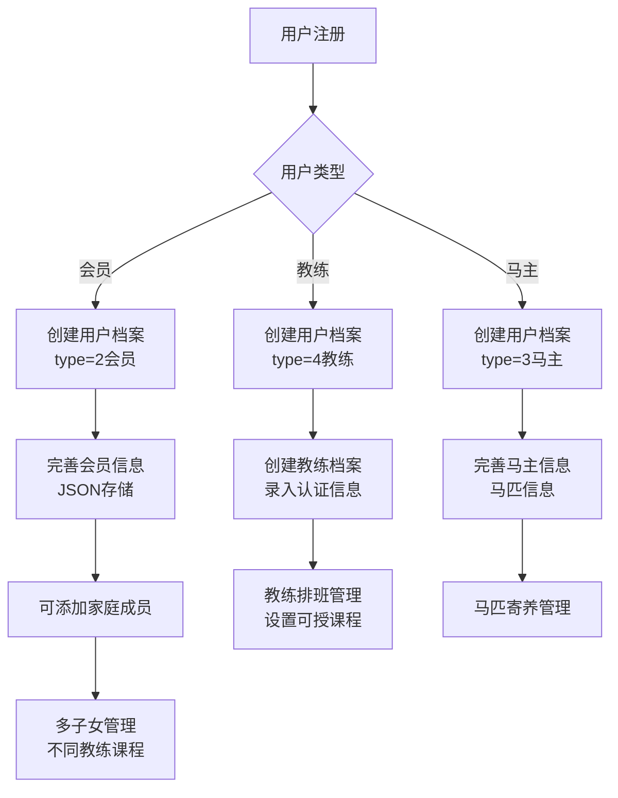
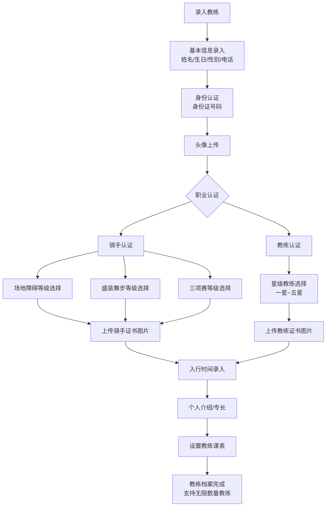
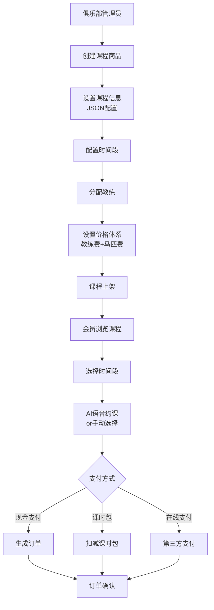
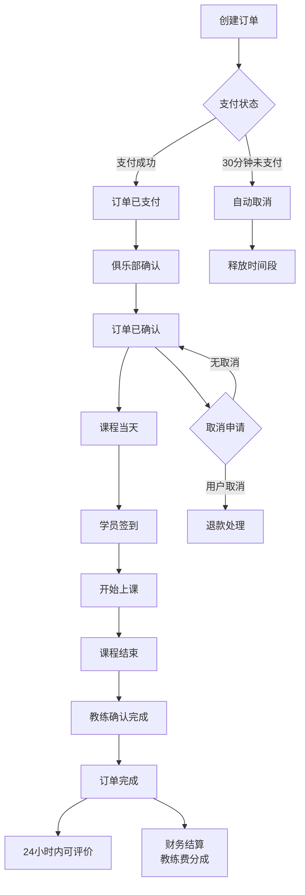
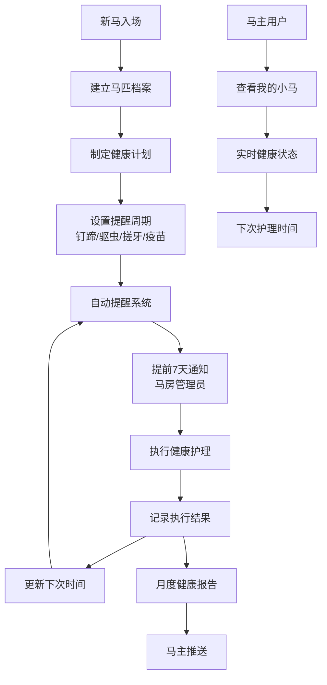
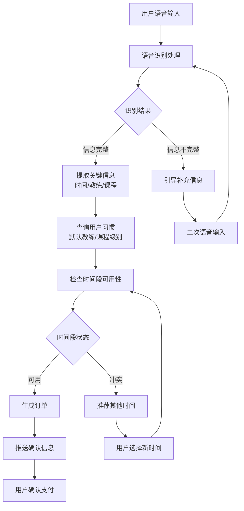
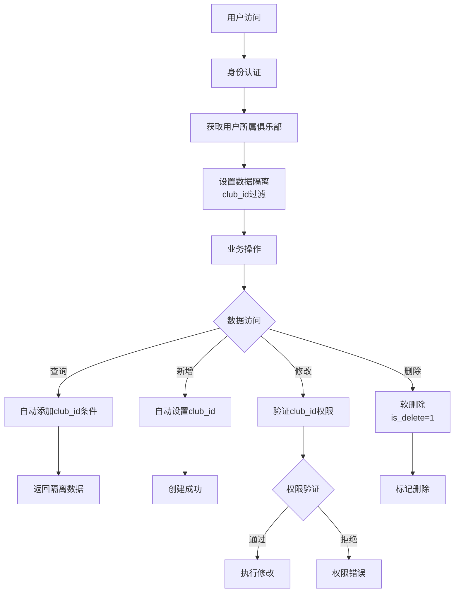
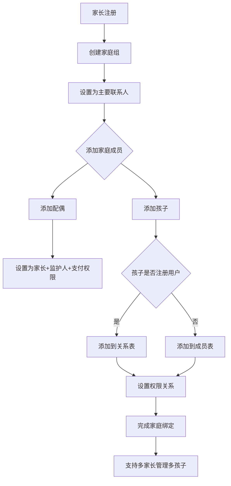

# 马术俱乐部SaaS系统数据库设计终版方案


## 一、统一审计字段标准

所有业务表统一使用以下审计字段：

```sql
-- 标准审计字段
create_by
varchar(50)    default ''                not null comment '创建人',
create_time              datetime       default CURRENT_TIMESTAMP not null comment '创建时间',
update_by                varchar(50)    default ''                not null comment '更新人',
update_time              datetime       default CURRENT_TIMESTAMP not null on
update CURRENT_TIMESTAMP comment '更新时间',
    is_valid int default 1 not null comment '是否有效;1=有效;0=无效;',
    is_delete int default 0 not null comment '是否删除;1=已删除;0=未删除;'
```

## 二、优化说明

### 2.1 优化要点

1. **移除冗余status字段**: 
   - 俱乐部表 m_club 移除 status 字段，使用 is_valid 替代
   - 课程时间段表 m_course_time_slot 移除 status 字段
   - 用户课时包表 m_user_package 移除 status 字段
   - 马匹表 m_horse 移除 status 字段
   - 马匹健康计划表 m_horse_health_plan 移除 status 字段
   - 订单评价表 m_order_evaluation 移除 status 字段

2. **移除俱乐部管理员表**:
   - 删除 m_club_manager 表，直接使用Smart Admin v3的RBAC系统
   - 通过 m_user_profile 表的 club_id 字段关联用户和俱乐部
   - 使用现有的角色权限体系管理俱乐部管理员权限

3. **优化马匹分类管理**:
   - m_horse 表的马类型增加教练马选项: 1-俱乐部马 2-马主马 3-教练马
   - 支持教练拥有专属教学用马的管理需求

4. **俱乐部营业时间优化**:
   - m_club 表的 business_hours 字段拆分为 business_start_time 和 business_end_time
   - 使用TIME类型精确存储开始和结束时间
   - 便于系统进行营业时间判断和课程安排

5. **统一JSON字段类型为TEXT**:
   - 所有 JSON 类型字段改为 TEXT 类型
   - 在注释中明确标注为 "JSON格式"
   - 提高数据库兼容性，便于数据处理

6. **统一时间字段为DATETIME类型**:
   - 所有 DATE 类型的时间字段更改为 DATETIME
   - 所有 TIME 类型的时间字段更改为 DATETIME（除营业时间外）
   - 统一时间精度，支持具体到秒级别

7. **统一图片字段命名**:
   - 所有图片相关字段统一使用 _url 后缀
   - 如：logo → logo_url，banner → banner_url，avatar → avatar_url，images → img_url
   - 明确表示存储的是图片地址而非二进制数据

8. **简化状态管理**:
   - 优先使用 is_valid 和 is_delete 字段管理状态
   - 只在必要时保留业务状态字段（如订单状态、支付状态）
   - 减少状态字段冗余，简化逻辑

### 2.2 优化效果

- **数据一致性**: 统一的字段命名和类型规范
- **简化维护**: 减少冗余状态字段，降低维护复杂度  
- **提高性能**: 统一时间类型，优化查询效率
- **增强可读性**: 明确的字段命名，提高代码可读性
- **权限统一**: 使用RBAC系统管理所有用户权限，避免重复建设
- **兼容性提升**: TEXT类型支持更好的跨数据库兼容性
- **业务扩展**: 支持教练马分类和精确营业时间管理

## 三、完整数据库表设计

### 3.1 用户扩展模块

```sql
-- 用户扩展表 - 基于现有RBAC体系的扩展
CREATE TABLE `m_user_profile`
(
    `id`           BIGINT PRIMARY KEY AUTO_INCREMENT COMMENT '主键ID',
    `user_id`      BIGINT                                NOT NULL COMMENT '关联t_employee.employee_id',
    `user_type`    TINYINT                               NOT NULL COMMENT '用户类型: 1-系统员工 2-俱乐部会员 3-马主 4-教练',
    `club_id`      BIGINT COMMENT '所属俱乐部ID',
    `profile_data` TEXT COMMENT '扩展数据JSON格式',
    `create_by`    VARCHAR(50) DEFAULT ''                NOT NULL COMMENT '创建人',
    `create_time`  DATETIME    DEFAULT CURRENT_TIMESTAMP NOT NULL COMMENT '创建时间',
    `update_by`    VARCHAR(50) DEFAULT ''                NOT NULL COMMENT '更新人',
    `update_time`  DATETIME    DEFAULT CURRENT_TIMESTAMP NOT NULL ON UPDATE CURRENT_TIMESTAMP COMMENT '更新时间',
    `is_valid`     INT         DEFAULT 1                 NOT NULL COMMENT '是否有效;1=有效;0=无效;',
    `is_delete`    INT         DEFAULT 0                 NOT NULL COMMENT '是否删除;1=已删除;0=未删除;',
    UNIQUE KEY `uk_user_type` (`user_id`, `user_type`),
    INDEX          `idx_user_id` (`user_id`),
    INDEX          `idx_club_id` (`club_id`),
    INDEX          `idx_user_type` (`user_type`)
) ENGINE=InnoDB DEFAULT CHARSET=utf8mb4 COMMENT='用户扩展信息表';

-- 家庭成员表
CREATE TABLE `m_family_member`
(
    `id`                   BIGINT PRIMARY KEY AUTO_INCREMENT COMMENT '主键ID',
    `parent_user_id`       BIGINT                                NOT NULL COMMENT '家长用户ID',
    `member_name`          VARCHAR(50)                           NOT NULL COMMENT '成员姓名',
    `age`                  INT COMMENT '年龄',
    `gender`               TINYINT COMMENT '性别: 1-男 2-女',
    `id_card_encrypted`    VARCHAR(255) COMMENT '身份证号(加密)',
    `rider_cert_no`        VARCHAR(50) COMMENT '骑手证号',
    `relationship`         VARCHAR(20) COMMENT '关系: child-子女, spouse-配偶',
    `is_adult`             TINYINT                               NOT NULL DEFAULT 0 COMMENT '是否成年: 1-是 0-否',
    `guardian_name`        VARCHAR(50) COMMENT '监护人姓名',
    `guardian_phone`       VARCHAR(20) COMMENT '监护人电话',
    `default_coach_id`     BIGINT COMMENT '默认教练ID',
    `default_course_level` VARCHAR(20) COMMENT '默认课程级别',
    `profile_data`         TEXT COMMENT '扩展信息JSON格式',
    `create_by`            VARCHAR(50) DEFAULT ''                NOT NULL COMMENT '创建人',
    `create_time`          DATETIME    DEFAULT CURRENT_TIMESTAMP NOT NULL COMMENT '创建时间',
    `update_by`            VARCHAR(50) DEFAULT ''                NOT NULL COMMENT '更新人',
    `update_time`          DATETIME    DEFAULT CURRENT_TIMESTAMP NOT NULL ON UPDATE CURRENT_TIMESTAMP COMMENT '更新时间',
    `is_valid`             INT         DEFAULT 1                 NOT NULL COMMENT '是否有效;1=有效;0=无效;',
    `is_delete`            INT         DEFAULT 0                 NOT NULL COMMENT '是否删除;1=已删除;0=未删除;',
    INDEX                  `idx_parent_user_id` (`parent_user_id`)
) ENGINE=InnoDB DEFAULT CHARSET=utf8mb4 COMMENT='家庭成员表';
```

### 3.2 俱乐部管理模块

```sql
-- 俱乐部表 - 独立设计
CREATE TABLE `m_club`
(
    `club_id`                BIGINT PRIMARY KEY AUTO_INCREMENT COMMENT '俱乐部ID',
    `club_name`              VARCHAR(100)                          NOT NULL COMMENT '俱乐部名称',
    `club_code`              VARCHAR(50) UNIQUE COMMENT '俱乐部编码',
    `logo_url`               VARCHAR(500) COMMENT 'LOGO地址',
    `banner_url`             VARCHAR(500) COMMENT '置顶图片地址',
    `pc_banner_url`          VARCHAR(500) COMMENT 'PC端首页图片地址',
    `business_start_time`    TIME COMMENT '营业开始时间',
    `business_end_time`      TIME COMMENT '营业结束时间',
    `address`                VARCHAR(200) COMMENT '详细地址',
    `phone`                  VARCHAR(20) COMMENT '电话',
    `description`            TEXT COMMENT '俱乐部详情',
    `honor_info`             TEXT COMMENT '荣誉信息',
    `booking_notice`         TEXT COMMENT '约课需知',
    `latitude`               DECIMAL(10, 6) COMMENT '纬度',
    `longitude`              DECIMAL(10, 6) COMMENT '经度',
    `province`               VARCHAR(50) COMMENT '省份',
    `city`                   VARCHAR(50) COMMENT '城市',
    `district`               VARCHAR(50) COMMENT '区县',
    `business_license_url`   VARCHAR(500) COMMENT '营业执照图片地址',
    `legal_person`           VARCHAR(50) COMMENT '法人代表',
    `contact_person`         VARCHAR(50) COMMENT '联系人',
    `contact_phone`          VARCHAR(20) COMMENT '联系电话',
    `email`                  VARCHAR(100) COMMENT '邮箱',
    `expire_date`            DATETIME COMMENT '到期日期时间',
    `create_by`              VARCHAR(50) DEFAULT ''                NOT NULL COMMENT '创建人',
    `create_time`            DATETIME    DEFAULT CURRENT_TIMESTAMP NOT NULL COMMENT '创建时间',
    `update_by`              VARCHAR(50) DEFAULT ''                NOT NULL COMMENT '更新人',
    `update_time`            DATETIME    DEFAULT CURRENT_TIMESTAMP NOT NULL ON UPDATE CURRENT_TIMESTAMP COMMENT '更新时间',
    `is_valid`               INT         DEFAULT 1                 NOT NULL COMMENT '是否有效;1=有效;0=无效;',
    `is_delete`              INT         DEFAULT 0                 NOT NULL COMMENT '是否删除;1=已删除;0=未删除;',
    INDEX                    `idx_club_code` (`club_code`)
) ENGINE=InnoDB DEFAULT CHARSET=utf8mb4 COMMENT='俱乐部表';
```

### 3.3 教练管理模块

```sql
-- 教练表
CREATE TABLE `m_coach`
(
    `coach_id`               BIGINT PRIMARY KEY AUTO_INCREMENT COMMENT '教练ID',
    `club_id`                BIGINT                                NOT NULL COMMENT '俱乐部ID',
    `user_id`                BIGINT                                NOT NULL COMMENT '关联用户ID',
    `coach_no`               VARCHAR(50) COMMENT '教练编号',
    `avatar_url`             VARCHAR(500) COMMENT '头像照片地址',
    `real_name`              VARCHAR(50)                           NOT NULL COMMENT '真实姓名',
    `birth_date`             DATETIME COMMENT '生日时间(仅后台展示)',
    `gender`                 TINYINT COMMENT '性别: 1-男 2-女',
    `id_card_encrypted`      VARCHAR(255) COMMENT '身份证号码(加密,仅后台)',
    `phone`                  VARCHAR(20) COMMENT '联系电话',
    `entry_date`             DATETIME COMMENT '入行时间',
    `specialties`            VARCHAR(200) COMMENT '专长领域',
    `introduction`           TEXT COMMENT '个人介绍',
    `rider_cert_no`          VARCHAR(100) COMMENT '骑手证号码',
    `rider_level_show_jumping` VARCHAR(20) COMMENT '场地障碍等级: 初三,初二,初一,中三,中二,中一,国三,国二,国一,健将级',
    `rider_level_dressage`   VARCHAR(20) COMMENT '盛装舞步等级: 初三,初二,初一,中三,中二,中一,国三,国二,国一,健将级',
    `rider_level_eventing`   VARCHAR(20) COMMENT '三项赛等级: 初三,初二,初一,中三,中二,中一,国三,国二,国一,健将级',
    `rider_cert_img_url`     TEXT COMMENT '骑手证书图片地址JSON格式',
    `coach_cert_no`          VARCHAR(100) COMMENT '星级教练证号码',
    `coach_level`            VARCHAR(20) COMMENT '教练等级: 一星,二星,三星,四星,五星',
    `coach_cert_img_url`     TEXT COMMENT '教练证书图片地址JSON格式',
    `sort_order`             INT         DEFAULT 0 COMMENT '排序',
    `create_by`              VARCHAR(50) DEFAULT ''                NOT NULL COMMENT '创建人',
    `create_time`            DATETIME    DEFAULT CURRENT_TIMESTAMP NOT NULL COMMENT '创建时间',
    `update_by`              VARCHAR(50) DEFAULT ''                NOT NULL COMMENT '更新人',
    `update_time`            DATETIME    DEFAULT CURRENT_TIMESTAMP NOT NULL ON UPDATE CURRENT_TIMESTAMP COMMENT '更新时间',
    `is_valid`               INT         DEFAULT 1                 NOT NULL COMMENT '是否有效;1=有效;0=无效;',
    `is_delete`              INT         DEFAULT 0                 NOT NULL COMMENT '是否删除;1=已删除;0=未删除;',
    UNIQUE KEY `uk_club_user` (`club_id`, `user_id`),
    INDEX                    `idx_club_id` (`club_id`),
    INDEX                    `idx_user_id` (`user_id`),
    INDEX                    `idx_coach_no` (`coach_no`)
) ENGINE=InnoDB DEFAULT CHARSET=utf8mb4 COMMENT='教练表';

-- 教练课表时间段表
CREATE TABLE `m_coach_schedule`
(
    `id`             BIGINT PRIMARY KEY AUTO_INCREMENT COMMENT '主键ID',
    `club_id`        BIGINT                                NOT NULL COMMENT '俱乐部ID',
    `coach_id`       BIGINT                                NOT NULL COMMENT '教练ID',
    `schedule_date`  DATETIME                              NOT NULL COMMENT '日期时间',
    `start_time`     DATETIME                              NOT NULL COMMENT '开始时间',
    `end_time`       DATETIME                              NOT NULL COMMENT '结束时间',
    `max_students`   INT         DEFAULT 1 COMMENT '最大学员数',
    `booked_count`   INT         DEFAULT 0 COMMENT '已预约数量',
    `available_courses` TEXT COMMENT '可授课程ID列表JSON格式',
    `remark`         VARCHAR(200) COMMENT '备注',
    `create_by`      VARCHAR(50) DEFAULT ''                NOT NULL COMMENT '创建人',
    `create_time`    DATETIME    DEFAULT CURRENT_TIMESTAMP NOT NULL COMMENT '创建时间',
    `update_by`      VARCHAR(50) DEFAULT ''                NOT NULL COMMENT '更新人',
    `update_time`    DATETIME    DEFAULT CURRENT_TIMESTAMP NOT NULL ON UPDATE CURRENT_TIMESTAMP COMMENT '更新时间',
    `is_valid`       INT         DEFAULT 1                 NOT NULL COMMENT '是否有效;1=有效;0=无效;',
    `is_delete`      INT         DEFAULT 0                 NOT NULL COMMENT '是否删除;1=已删除;0=未删除;',
    UNIQUE KEY `uk_coach_datetime` (`coach_id`, `schedule_date`, `start_time`),
    INDEX            `idx_club_id` (`club_id`),
    INDEX            `idx_coach_id` (`coach_id`),
    INDEX            `idx_schedule_date` (`schedule_date`)
) ENGINE=InnoDB DEFAULT CHARSET=utf8mb4 COMMENT='教练课表时间段表';
```

### 3.4 商品管理模块 (课程作为商品)

```sql
-- 扩展现有商品表用于课程管理
ALTER TABLE `t_goods`
    ADD COLUMN `club_id` BIGINT COMMENT '俱乐部ID';
ALTER TABLE `t_goods`
    ADD COLUMN `goods_type` VARCHAR(50) DEFAULT 'course' COMMENT '商品类型: course-课程, package-课时包, activity-活动';
ALTER TABLE `t_goods`
    ADD COLUMN `course_config` TEXT COMMENT '课程配置JSON格式';
ALTER TABLE `t_goods`
    ADD COLUMN `create_by` VARCHAR(50) DEFAULT '' NOT NULL COMMENT '创建人';
ALTER TABLE `t_goods`
    ADD COLUMN `update_by` VARCHAR(50) DEFAULT '' NOT NULL COMMENT '更新人';
ALTER TABLE `t_goods`
    ADD COLUMN `is_valid` INT DEFAULT 1 NOT NULL COMMENT '是否有效;1=有效;0=无效;';
ALTER TABLE `t_goods`
    ADD COLUMN `is_delete` INT DEFAULT 0 NOT NULL COMMENT '是否删除;1=已删除;0=未删除;';

-- 课程时间段表
CREATE TABLE `m_course_time_slot`
(
    `id`             BIGINT PRIMARY KEY AUTO_INCREMENT COMMENT '主键ID',
    `club_id`        BIGINT                                NOT NULL COMMENT '俱乐部ID',
    `course_id`      BIGINT                                NOT NULL COMMENT '课程ID(goods_id)',
    `coach_id`       BIGINT                                NOT NULL COMMENT '教练ID',
    `available_date` DATETIME                             NOT NULL COMMENT '可用日期',
    `start_time`     DATETIME                              NOT NULL COMMENT '开始时间',
    `end_time`       DATETIME                              NOT NULL COMMENT '结束时间',
    `max_capacity`   INT         DEFAULT 1 COMMENT '最大容量',
    `booked_count`   INT         DEFAULT 0 COMMENT '已预约数量',
    `create_by`      VARCHAR(50) DEFAULT ''                NOT NULL COMMENT '创建人',
    `create_time`    DATETIME    DEFAULT CURRENT_TIMESTAMP NOT NULL COMMENT '创建时间',
    `update_by`      VARCHAR(50) DEFAULT ''                NOT NULL COMMENT '更新人',
    `update_time`    DATETIME    DEFAULT CURRENT_TIMESTAMP NOT NULL ON UPDATE CURRENT_TIMESTAMP COMMENT '更新时间',
    `is_valid`       INT         DEFAULT 1                 NOT NULL COMMENT '是否有效;1=有效;0=无效;',
    `is_delete`      INT         DEFAULT 0                 NOT NULL COMMENT '是否删除;1=已删除;0=未删除;',
    UNIQUE KEY `uk_course_coach_time` (`course_id`, `coach_id`, `available_date`, `start_time`),
    INDEX            `idx_club_id` (`club_id`),
    INDEX            `idx_course_id` (`course_id`),
    INDEX            `idx_coach_id` (`coach_id`),
    INDEX            `idx_available_date` (`available_date`)
) ENGINE=InnoDB DEFAULT CHARSET=utf8mb4 COMMENT='课程时间段表';
```

### 3.5 订单管理模块 (替代预约表)

```sql
-- 订单表 - 核心业务表
CREATE TABLE `m_order`
(
    `order_id`         BIGINT PRIMARY KEY AUTO_INCREMENT COMMENT '订单ID',
    `order_no`         VARCHAR(50)                              NOT NULL UNIQUE COMMENT '订单号',
    `club_id`          BIGINT                                   NOT NULL COMMENT '俱乐部ID',
    `customer_id`      BIGINT                                   NOT NULL COMMENT '客户ID(user_id)',
    `customer_type`    TINYINT                                  NOT NULL COMMENT '客户类型: 1-会员 2-家庭成员',
    `family_member_id` BIGINT COMMENT '家庭成员ID',
    `order_type`       VARCHAR(50)                              NOT NULL COMMENT '订单类型: course-课程, package-课时包, activity-活动',
    `goods_id`         BIGINT                                   NOT NULL COMMENT '商品ID',
    `goods_name`       VARCHAR(100)                             NOT NULL COMMENT '商品名称',
    `time_slot_id`     BIGINT COMMENT '时间段ID(课程订单必填)',
    `coach_id`         BIGINT COMMENT '教练ID',
    `horse_id`         BIGINT COMMENT '马匹ID',
    `order_date`       DATETIME                                 NOT NULL COMMENT '订单日期时间',
    `class_date`       DATETIME COMMENT '上课日期时间',
    `start_time`       DATETIME COMMENT '开始时间',
    `end_time`         DATETIME COMMENT '结束时间',
    `duration`         INT COMMENT '时长(分钟)',
    `student_count`    INT            DEFAULT 1 COMMENT '学员数量',
    `unit_price`       DECIMAL(10, 2)                           NOT NULL COMMENT '单价',
    `total_amount`     DECIMAL(10, 2)                           NOT NULL COMMENT '总金额',
    `coach_fee`        DECIMAL(10, 2) COMMENT '教练费',
    `horse_fee`        DECIMAL(10, 2) COMMENT '马匹费',
    `discount_amount`  DECIMAL(10, 2) DEFAULT 0 COMMENT '优惠金额',
    `actual_amount`    DECIMAL(10, 2)                           NOT NULL COMMENT '实付金额',
    `payment_method`   VARCHAR(50) COMMENT '支付方式: wechat, alipay, cash, package',
    `package_id`       BIGINT COMMENT '使用的课时包ID',
    `order_source`     VARCHAR(50)    DEFAULT 'manual' COMMENT '订单来源: ai, manual, wechat',
    `order_status`     TINYINT                                  NOT NULL DEFAULT 0 COMMENT '订单状态: 0-待支付 1-已支付 2-已确认 3-已完成 4-已取消 5-已退款',
    `payment_status`   TINYINT                                  NOT NULL DEFAULT 0 COMMENT '支付状态: 0-未支付 1-已支付 2-已退款',
    `class_status`     TINYINT        DEFAULT 0 COMMENT '上课状态: 0-未开始 1-进行中 2-已完成 3-已取消',
    `check_in_time`    DATETIME COMMENT '签到时间',
    `check_in_by`      VARCHAR(50) COMMENT '签到操作人',
    `finish_time`      DATETIME COMMENT '完成时间',
    `cancel_time`      DATETIME COMMENT '取消时间',
    `cancel_reason`    VARCHAR(200) COMMENT '取消原因',
    `refund_amount`    DECIMAL(10, 2) DEFAULT 0 COMMENT '退款金额',
    `refund_time`      DATETIME COMMENT '退款时间',
    `remark`           VARCHAR(500) COMMENT '备注',
    `order_data`       TEXT COMMENT '订单扩展数据JSON格式',
    `create_by`        VARCHAR(50)    DEFAULT ''                NOT NULL COMMENT '创建人',
    `create_time`      DATETIME       DEFAULT CURRENT_TIMESTAMP NOT NULL COMMENT '创建时间',
    `update_by`        VARCHAR(50)    DEFAULT ''                NOT NULL COMMENT '更新人',
    `update_time`      DATETIME       DEFAULT CURRENT_TIMESTAMP NOT NULL ON UPDATE CURRENT_TIMESTAMP COMMENT '更新时间',
    `is_valid`         INT            DEFAULT 1                 NOT NULL COMMENT '是否有效;1=有效;0=无效;',
    `is_delete`        INT            DEFAULT 0                 NOT NULL COMMENT '是否删除;1=已删除;0=未删除;',
    INDEX              `idx_order_no` (`order_no`),
    INDEX              `idx_club_id` (`club_id`),
    INDEX              `idx_customer_id` (`customer_id`),
    INDEX              `idx_coach_id` (`coach_id`),
    INDEX              `idx_order_date` (`order_date`),
    INDEX              `idx_class_date` (`class_date`),
    INDEX              `idx_order_status` (`order_status`),
    INDEX              `idx_payment_status` (`payment_status`),
    INDEX              `idx_create_time` (`create_time`)
) ENGINE=InnoDB DEFAULT CHARSET=utf8mb4 COMMENT='订单表';

-- 订单学员表 (小组课支持多学员)
CREATE TABLE `m_order_student`
(
    `id`           BIGINT PRIMARY KEY AUTO_INCREMENT COMMENT '主键ID',
    `order_id`     BIGINT                                NOT NULL COMMENT '订单ID',
    `student_type` TINYINT                               NOT NULL COMMENT '学员类型: 1-主账号 2-家庭成员',
    `student_id`   BIGINT COMMENT '学员ID',
    `student_name` VARCHAR(50)                           NOT NULL COMMENT '学员姓名',
    `age`          INT COMMENT '年龄',
    `level`        VARCHAR(50) COMMENT '水平等级',
    `create_by`    VARCHAR(50) DEFAULT ''                NOT NULL COMMENT '创建人',
    `create_time`  DATETIME    DEFAULT CURRENT_TIMESTAMP NOT NULL COMMENT '创建时间',
    `update_by`    VARCHAR(50) DEFAULT ''                NOT NULL COMMENT '更新人',
    `update_time`  DATETIME    DEFAULT CURRENT_TIMESTAMP NOT NULL ON UPDATE CURRENT_TIMESTAMP COMMENT '更新时间',
    `is_valid`     INT         DEFAULT 1                 NOT NULL COMMENT '是否有效;1=有效;0=无效;',
    `is_delete`    INT         DEFAULT 0                 NOT NULL COMMENT '是否删除;1=已删除;0=未删除;',
    INDEX          `idx_order_id` (`order_id`),
    INDEX          `idx_student_id` (`student_id`)
) ENGINE=InnoDB DEFAULT CHARSET=utf8mb4 COMMENT='订单学员表';

-- 订单评价表
CREATE TABLE `m_order_evaluation`
(
    `id`                BIGINT PRIMARY KEY AUTO_INCREMENT COMMENT '主键ID',
    `order_id`          BIGINT                                NOT NULL COMMENT '订单ID',
    `customer_id`       BIGINT                                NOT NULL COMMENT '客户ID',
    `coach_score`       INT                                   NOT NULL COMMENT '教练评分(1-5)',
    `course_score`      INT                                   NOT NULL COMMENT '课程评分(1-5)',
    `service_score`     INT                                   NOT NULL COMMENT '服务评分(1-5)',
    `overall_score`     DECIMAL(3, 2) COMMENT '综合评分',
    `content`           TEXT COMMENT '评价内容',
    `img_url`           TEXT COMMENT '图片地址JSON格式',
    `is_anonymous`      TINYINT     DEFAULT 0 COMMENT '是否匿名: 1-是 0-否',
    `club_visible_only` TINYINT     DEFAULT 1 COMMENT '仅俱乐部可见: 1-是 0-否',
    `create_by`         VARCHAR(50) DEFAULT ''                NOT NULL COMMENT '创建人',
    `create_time`       DATETIME    DEFAULT CURRENT_TIMESTAMP NOT NULL COMMENT '创建时间',
    `update_by`         VARCHAR(50) DEFAULT ''                NOT NULL COMMENT '更新人',
    `update_time`       DATETIME    DEFAULT CURRENT_TIMESTAMP NOT NULL ON UPDATE CURRENT_TIMESTAMP COMMENT '更新时间',
    `is_valid`          INT         DEFAULT 1                 NOT NULL COMMENT '是否有效;1=有效;0=无效;',
    `is_delete`         INT         DEFAULT 0                 NOT NULL COMMENT '是否删除;1=已删除;0=未删除;',
    UNIQUE KEY `uk_order_customer` (`order_id`, `customer_id`),
    INDEX               `idx_order_id` (`order_id`),
    INDEX               `idx_customer_id` (`customer_id`)
) ENGINE=InnoDB DEFAULT CHARSET=utf8mb4 COMMENT='订单评价表';
```

### 3.6 用户课时包管理

```sql
-- 用户课时包表
CREATE TABLE `m_user_package`
(
    `id`                 BIGINT PRIMARY KEY AUTO_INCREMENT COMMENT '主键ID',
    `user_id`            BIGINT                                NOT NULL COMMENT '用户ID',
    `package_order_id`   BIGINT                                NOT NULL COMMENT '购买订单ID',
    `package_id`         BIGINT                                NOT NULL COMMENT '课时包商品ID',
    `package_name`       VARCHAR(100)                          NOT NULL COMMENT '课时包名称',
    `total_lessons`      INT                                   NOT NULL COMMENT '总课时数',
    `used_lessons`       INT         DEFAULT 0 COMMENT '已用课时数',
    `remaining_lessons`  INT                                   NOT NULL COMMENT '剩余课时数',
    `purchase_date`      DATETIME                              NOT NULL COMMENT '购买日期时间',
    `expire_date`        DATETIME COMMENT '到期日期时间',
    `applicable_courses` TEXT COMMENT '适用课程ID列表JSON格式',
    `create_by`          VARCHAR(50) DEFAULT ''                NOT NULL COMMENT '创建人',
    `create_time`        DATETIME    DEFAULT CURRENT_TIMESTAMP NOT NULL COMMENT '创建时间',
    `update_by`          VARCHAR(50) DEFAULT ''                NOT NULL COMMENT '更新人',
    `update_time`        DATETIME    DEFAULT CURRENT_TIMESTAMP NOT NULL ON UPDATE CURRENT_TIMESTAMP COMMENT '更新时间',
    `is_valid`           INT         DEFAULT 1                 NOT NULL COMMENT '是否有效;1=有效;0=无效;',
    `is_delete`          INT         DEFAULT 0                 NOT NULL COMMENT '是否删除;1=已删除;0=未删除;',
    INDEX                `idx_user_id` (`user_id`),
    INDEX                `idx_status` (`status`),
    INDEX                `idx_expire_date` (`expire_date`)
) ENGINE=InnoDB DEFAULT CHARSET=utf8mb4 COMMENT='用户课时包表';

-- 课时包使用记录表
CREATE TABLE `m_package_usage_log`
(
    `id`                BIGINT PRIMARY KEY AUTO_INCREMENT COMMENT '主键ID',
    `user_package_id`   BIGINT                                NOT NULL COMMENT '用户课时包ID',
    `order_id`          BIGINT                                NOT NULL COMMENT '使用的订单ID',
    `used_lessons`      INT                                   NOT NULL COMMENT '使用课时数',
    `remaining_lessons` INT                                   NOT NULL COMMENT '剩余课时数',
    `usage_date`        DATETIME                              NOT NULL COMMENT '使用日期时间',
    `create_by`         VARCHAR(50) DEFAULT ''                NOT NULL COMMENT '创建人',
    `create_time`       DATETIME    DEFAULT CURRENT_TIMESTAMP NOT NULL COMMENT '创建时间',
    `update_by`         VARCHAR(50) DEFAULT ''                NOT NULL COMMENT '更新人',
    `update_time`       DATETIME    DEFAULT CURRENT_TIMESTAMP NOT NULL ON UPDATE CURRENT_TIMESTAMP COMMENT '更新时间',
    `is_valid`          INT         DEFAULT 1                 NOT NULL COMMENT '是否有效;1=有效;0=无效;',
    `is_delete`         INT         DEFAULT 0                 NOT NULL COMMENT '是否删除;1=已删除;0=未删除;',
    INDEX               `idx_user_package_id` (`user_package_id`),
    INDEX               `idx_order_id` (`order_id`),
    INDEX               `idx_usage_date` (`usage_date`)
) ENGINE=InnoDB DEFAULT CHARSET=utf8mb4 COMMENT='课时包使用记录表';
```

### 3.7 马匹管理模块

```sql
-- 马匹表  ******护照类型   
CREATE TABLE `m_horse`
(
    `horse_id`             BIGINT PRIMARY KEY AUTO_INCREMENT COMMENT '马匹ID',
    `club_id`              BIGINT                                NOT NULL COMMENT '俱乐部ID',
    `horse_name`           VARCHAR(100)                          NOT NULL COMMENT '马名',
    `horse_code`           VARCHAR(50) COMMENT '马匹编号',
    `breed`                VARCHAR(50) COMMENT '品种',
    `gender`               TINYINT COMMENT '性别: 1-公 2-母 3-骟',
    `color`                VARCHAR(50) COMMENT '毛色',
    `birth_date`           DATETIME COMMENT '出生日期时间',
    `chip_no`              VARCHAR(100) UNIQUE COMMENT '芯片号',
    `passport_no`          VARCHAR(100) COMMENT '护照号',
    `pedigree_cert_url`    VARCHAR(500) COMMENT '血统证书图片地址',
    `horse_type`           TINYINT                               NOT NULL COMMENT '类型: 1-俱乐部马 2-马主马 3-教练马',
    `owner_id`             BIGINT COMMENT '马主ID(马主马)',
    `responsible_coach_id` BIGINT COMMENT '责任教练ID',
    `responsible_groom_id` BIGINT COMMENT '责任马工ID',
    `boarding_start_date`  DATETIME COMMENT '寄养开始日期时间',
    `boarding_end_date`    DATETIME COMMENT '寄养结束日期时间',
    `health_status`        TINYINT     DEFAULT 1 COMMENT '健康状态: 1-健康 2-观察 3-治疗',
    `work_status`          TINYINT     DEFAULT 1 COMMENT '工作状态: 1-可用 2-休息 3-治疗',
    `horse_data`           TEXT COMMENT '马匹扩展数据JSON格式',
    `create_by`            VARCHAR(50) DEFAULT ''                NOT NULL COMMENT '创建人',
    `create_time`          DATETIME    DEFAULT CURRENT_TIMESTAMP NOT NULL COMMENT '创建时间',
    `update_by`            VARCHAR(50) DEFAULT ''                NOT NULL COMMENT '更新人',
    `update_time`          DATETIME    DEFAULT CURRENT_TIMESTAMP NOT NULL ON UPDATE CURRENT_TIMESTAMP COMMENT '更新时间',
    `is_valid`             INT         DEFAULT 1                 NOT NULL COMMENT '是否有效;1=有效;0=无效;',
    `is_delete`            INT         DEFAULT 0                 NOT NULL COMMENT '是否删除;1=已删除;0=未删除;',
    INDEX                  `idx_club_id` (`club_id`),
    INDEX                  `idx_owner_id` (`owner_id`),
    INDEX                  `idx_chip_no` (`chip_no`),
    INDEX                  `idx_horse_type` (`horse_type`)
) ENGINE=InnoDB DEFAULT CHARSET=utf8mb4 COMMENT='马匹表';

-- 马匹健康计划表
CREATE TABLE `m_horse_health_plan`
(
    `id`            BIGINT PRIMARY KEY AUTO_INCREMENT COMMENT '主键ID',
    `horse_id`      BIGINT                                NOT NULL COMMENT '马匹ID',
    `plan_type`     VARCHAR(50)                           NOT NULL COMMENT '计划类型: shoeing-钉蹄, deworming-驱虫, dental-搓牙, vaccine-疫苗, medication-用药',
    `plan_name`     VARCHAR(100) COMMENT '计划名称',
    `cycle_days`    INT COMMENT '周期天数',
    `last_date`     DATETIME COMMENT '上次执行日期时间',
    `next_date`     DATETIME                              NOT NULL COMMENT '下次执行日期时间',
    `reminder_days` INT         DEFAULT 7 COMMENT '提前提醒天数',
    `plan_config`   TEXT COMMENT '计划配置JSON格式',
    `create_by`     VARCHAR(50) DEFAULT ''                NOT NULL COMMENT '创建人',
    `create_time`   DATETIME    DEFAULT CURRENT_TIMESTAMP NOT NULL COMMENT '创建时间',
    `update_by`     VARCHAR(50) DEFAULT ''                NOT NULL COMMENT '更新人',
    `update_time`   DATETIME    DEFAULT CURRENT_TIMESTAMP NOT NULL ON UPDATE CURRENT_TIMESTAMP COMMENT '更新时间',
    `is_valid`      INT         DEFAULT 1                 NOT NULL COMMENT '是否有效;1=有效;0=无效;',
    `is_delete`     INT         DEFAULT 0                 NOT NULL COMMENT '是否删除;1=已删除;0=未删除;',
    INDEX           `idx_horse_id` (`horse_id`),
    INDEX           `idx_next_date` (`next_date`),
    INDEX           `idx_plan_type` (`plan_type`)
) ENGINE=InnoDB DEFAULT CHARSET=utf8mb4 COMMENT='马匹健康计划表';

-- 马匹健康记录表
CREATE TABLE `m_horse_health_record`
(
    `id`          BIGINT PRIMARY KEY AUTO_INCREMENT COMMENT '主键ID',
    `horse_id`    BIGINT                                NOT NULL COMMENT '马匹ID',
    `plan_id`     BIGINT COMMENT '关联计划ID',
    `record_type` VARCHAR(50)                           NOT NULL COMMENT '记录类型',
    `record_date` DATETIME                              NOT NULL COMMENT '记录日期时间',
    `executor_id` BIGINT COMMENT '执行人ID',
    `content`     TEXT COMMENT '记录内容',
    `img_url`     TEXT COMMENT '图片地址JSON格式',
    `next_date`   DATETIME COMMENT '下次执行日期时间',
    `record_data` TEXT COMMENT '记录扩展数据JSON格式',
    `create_by`   VARCHAR(50) DEFAULT ''                NOT NULL COMMENT '创建人',
    `create_time` DATETIME    DEFAULT CURRENT_TIMESTAMP NOT NULL COMMENT '创建时间',
    `update_by`   VARCHAR(50) DEFAULT ''                NOT NULL COMMENT '更新人',
    `update_time` DATETIME    DEFAULT CURRENT_TIMESTAMP NOT NULL ON UPDATE CURRENT_TIMESTAMP COMMENT '更新时间',
    `is_valid`    INT         DEFAULT 1                 NOT NULL COMMENT '是否有效;1=有效;0=无效;',
    `is_delete`   INT         DEFAULT 0                 NOT NULL COMMENT '是否删除;1=已删除;0=未删除;',
    INDEX         `idx_horse_id` (`horse_id`),
    INDEX         `idx_plan_id` (`plan_id`),
    INDEX         `idx_record_date` (`record_date`),
    INDEX         `idx_record_type` (`record_type`)
) ENGINE=InnoDB DEFAULT CHARSET=utf8mb4 COMMENT='马匹健康记录表';
```

### 3.8 支付财务模块

```sql
-- 支付记录表
CREATE TABLE `m_payment`
(
    `payment_id`      BIGINT PRIMARY KEY AUTO_INCREMENT COMMENT '支付ID',
    `payment_no`      VARCHAR(50)                              NOT NULL UNIQUE COMMENT '支付单号',
    `order_id`        BIGINT                                   NOT NULL COMMENT '订单ID',
    `order_no`        VARCHAR(50)                              NOT NULL COMMENT '订单号',
    `club_id`         BIGINT                                   NOT NULL COMMENT '俱乐部ID',
    `customer_id`     BIGINT                                   NOT NULL COMMENT '客户ID',
    `payment_amount`  DECIMAL(10, 2)                           NOT NULL COMMENT '支付金额',
    `payment_method`  VARCHAR(50)                              NOT NULL COMMENT '支付方式: wechat, alipay, cash, package',
    `payment_channel` VARCHAR(50) COMMENT '支付渠道',
    `transaction_id`  VARCHAR(100) COMMENT '第三方交易号',
    `payment_status`  TINYINT                                  NOT NULL DEFAULT 0 COMMENT '支付状态: 0-待支付 1-支付成功 2-支付失败 3-已退款',
    `payment_time`    DATETIME COMMENT '支付时间',
    `refund_amount`   DECIMAL(10, 2) DEFAULT 0 COMMENT '退款金额',
    `refund_time`     DATETIME COMMENT '退款时间',
    `refund_reason`   VARCHAR(200) COMMENT '退款原因',
    `payment_data`    TEXT COMMENT '支付扩展数据JSON格式',
    `create_by`       VARCHAR(50)    DEFAULT ''                NOT NULL COMMENT '创建人',
    `create_time`     DATETIME       DEFAULT CURRENT_TIMESTAMP NOT NULL COMMENT '创建时间',
    `update_by`       VARCHAR(50)    DEFAULT ''                NOT NULL COMMENT '更新人',
    `update_time`     DATETIME       DEFAULT CURRENT_TIMESTAMP NOT NULL ON UPDATE CURRENT_TIMESTAMP COMMENT '更新时间',
    `is_valid`        INT            DEFAULT 1                 NOT NULL COMMENT '是否有效;1=有效;0=无效;',
    `is_delete`       INT            DEFAULT 0                 NOT NULL COMMENT '是否删除;1=已删除;0=未删除;',
    INDEX             `idx_payment_no` (`payment_no`),
    INDEX             `idx_order_id` (`order_id`),
    INDEX             `idx_order_no` (`order_no`),
    INDEX             `idx_club_id` (`club_id`),
    INDEX             `idx_customer_id` (`customer_id`),
    INDEX             `idx_payment_status` (`payment_status`),
    INDEX             `idx_payment_time` (`payment_time`)
) ENGINE=InnoDB DEFAULT CHARSET=utf8mb4 COMMENT='支付记录表';

-- 财务统计表
CREATE TABLE `m_financial_summary`
(
    `id`                  BIGINT PRIMARY KEY AUTO_INCREMENT COMMENT '主键ID',
    `club_id`             BIGINT                                   NOT NULL COMMENT '俱乐部ID',
    `summary_date`        DATETIME                                 NOT NULL COMMENT '统计日期时间',
    `summary_type`        VARCHAR(50)                              NOT NULL COMMENT '统计类型: daily-日, monthly-月, yearly-年',
    `total_income`        DECIMAL(12, 2) DEFAULT 0 COMMENT '总收入',
    `course_income`       DECIMAL(12, 2) DEFAULT 0 COMMENT '课程收入',
    `package_income`      DECIMAL(12, 2) DEFAULT 0 COMMENT '课时包收入',
    `activity_income`     DECIMAL(12, 2) DEFAULT 0 COMMENT '活动收入',
    `total_refund`        DECIMAL(12, 2) DEFAULT 0 COMMENT '总退款',
    `total_coach_fee`     DECIMAL(12, 2) DEFAULT 0 COMMENT '总教练费',
    `order_count`         INT            DEFAULT 0 COMMENT '订单数量',
    `new_member_count`    INT            DEFAULT 0 COMMENT '新会员数量',
    `active_member_count` INT            DEFAULT 0 COMMENT '活跃会员数量',
    `summary_data`        TEXT COMMENT '统计扩展数据JSON格式',
    `create_by`           VARCHAR(50)    DEFAULT ''                NOT NULL COMMENT '创建人',
    `create_time`         DATETIME       DEFAULT CURRENT_TIMESTAMP NOT NULL COMMENT '创建时间',
    `update_by`           VARCHAR(50)    DEFAULT ''                NOT NULL COMMENT '更新人',
    `update_time`         DATETIME       DEFAULT CURRENT_TIMESTAMP NOT NULL ON UPDATE CURRENT_TIMESTAMP COMMENT '更新时间',
    `is_valid`            INT            DEFAULT 1                 NOT NULL COMMENT '是否有效;1=有效;0=无效;',
    `is_delete`           INT            DEFAULT 0                 NOT NULL COMMENT '是否删除;1=已删除;0=未删除;',
    UNIQUE KEY `uk_club_date_type` (`club_id`, `summary_date`, `summary_type`),
    INDEX                 `idx_club_id` (`club_id`),
    INDEX                 `idx_summary_date` (`summary_date`),
    INDEX                 `idx_summary_type` (`summary_type`)
) ENGINE=InnoDB DEFAULT CHARSET=utf8mb4 COMMENT='财务统计表';
```

## 四、核心业务流程图

### 4.1 用户注册和身份管理流程



### 4.2 教练管理流程



### 4.3 课程商品管理流程



### 4.4 订单生命周期流程



### 4.5 马匹健康管理流程



### 4.6 AI约课智能流程



### 4.7 多租户数据架构流程



## 五、关键技术要点

### 5.1 数据隔离策略

- **多租户设计**: 所有业务表都包含club_id字段
- **权限控制**: 基于用户所属俱乐部进行数据过滤
- **软删除**: 使用is_delete字段而非物理删除

### 5.2 扩展性设计

- **JSON字段**: 使用JSON存储不同用户类型的扩展信息
- **商品化课程**: 课程作为商品管理，支持灵活配置
- **统一订单**: 课程、活动、课时包统一使用订单表

### 5.3 性能优化

- **索引策略**: 为高频查询字段建立合适索引
- **分区表**: 大数据量表按时间分区
- **缓存机制**: 热点数据Redis缓存

### 5.4 业务特色

- **AI约课**: 智能识别用户习惯，自动匹配教练和课程
- **家庭管理**: 支持多子女不同教练和课程级别
- **马匹健康**: 完整的健康档案和自动提醒机制
- **财务结算**: 自动化的教练费结算和报表统计

## 六、家庭成员关系绑定方案分析

### 6.1 现有设计问题分析

当前的 `m_family_member` 表设计存在以下限制：
- 使用 `parent_user_id` 单一父级关联，无法处理多个家长的情况
- 一个孩子只能关联一个家长，不符合实际家庭结构
- 无法处理复杂的家庭关系（如重组家庭、隔代抚养等）

### 6.2 多对多家庭关系解决方案

#### 方案一：家庭组概念设计（推荐）

```sql
-- 家庭组表
CREATE TABLE `m_family_group`
(
    `family_group_id`   BIGINT PRIMARY KEY AUTO_INCREMENT COMMENT '家庭组ID',
    `family_name`       VARCHAR(50) NOT NULL COMMENT '家庭名称',
    `club_id`           BIGINT NOT NULL COMMENT '俱乐部ID',
    `main_contact_id`   BIGINT COMMENT '主要联系人ID',
    `description`       VARCHAR(200) COMMENT '家庭描述',
    `create_by`         VARCHAR(50) DEFAULT '' NOT NULL COMMENT '创建人',
    `create_time`       DATETIME DEFAULT CURRENT_TIMESTAMP NOT NULL COMMENT '创建时间',
    `update_by`         VARCHAR(50) DEFAULT '' NOT NULL COMMENT '更新人',
    `update_time`       DATETIME DEFAULT CURRENT_TIMESTAMP NOT NULL ON UPDATE CURRENT_TIMESTAMP COMMENT '更新时间',
    `is_valid`          INT DEFAULT 1 NOT NULL COMMENT '是否有效;1=有效;0=无效;',
    `is_delete`         INT DEFAULT 0 NOT NULL COMMENT '是否删除;1=已删除;0=未删除;',
    INDEX `idx_club_id` (`club_id`),
    INDEX `idx_main_contact_id` (`main_contact_id`)
) ENGINE=InnoDB DEFAULT CHARSET=utf8mb4 COMMENT='家庭组表';

-- 家庭成员关系表
CREATE TABLE `m_family_member_relation`
(
    `id`                BIGINT PRIMARY KEY AUTO_INCREMENT COMMENT '主键ID',
    `family_group_id`   BIGINT NOT NULL COMMENT '家庭组ID',
    `user_id`           BIGINT NOT NULL COMMENT '用户ID',
    `member_type`       TINYINT NOT NULL COMMENT '成员类型: 1-家长 2-孩子 3-其他',
    `relationship`      VARCHAR(20) COMMENT '关系: father-父亲, mother-母亲, child-子女, grandparent-祖父母等',
    `is_guardian`       TINYINT DEFAULT 0 COMMENT '是否监护人: 1-是 0-否',
    `can_book`          TINYINT DEFAULT 1 COMMENT '是否可预约: 1-可以 0-不可以',
    `can_pay`           TINYINT DEFAULT 0 COMMENT '是否可支付: 1-可以 0-不可以',
    `emergency_contact` TINYINT DEFAULT 0 COMMENT '是否紧急联系人: 1-是 0-否',
    `join_date`         DATETIME DEFAULT CURRENT_TIMESTAMP COMMENT '加入家庭日期',
    `create_by`         VARCHAR(50) DEFAULT '' NOT NULL COMMENT '创建人',
    `create_time`       DATETIME DEFAULT CURRENT_TIMESTAMP NOT NULL COMMENT '创建时间',
    `update_by`         VARCHAR(50) DEFAULT '' NOT NULL COMMENT '更新人',
    `update_time`       DATETIME DEFAULT CURRENT_TIMESTAMP NOT NULL ON UPDATE CURRENT_TIMESTAMP COMMENT '更新时间',
    `is_valid`          INT DEFAULT 1 NOT NULL COMMENT '是否有效;1=有效;0=无效;',
    `is_delete`         INT DEFAULT 0 NOT NULL COMMENT '是否删除;1=已删除;0=未删除;',
    UNIQUE KEY `uk_family_user` (`family_group_id`, `user_id`),
    INDEX `idx_family_group_id` (`family_group_id`),
    INDEX `idx_user_id` (`user_id`),
    INDEX `idx_member_type` (`member_type`)
) ENGINE=InnoDB DEFAULT CHARSET=utf8mb4 COMMENT='家庭成员关系表';

-- 重新设计的家庭成员表（针对未注册用户）
CREATE TABLE `m_family_member`
(
    `id`                   BIGINT PRIMARY KEY AUTO_INCREMENT COMMENT '主键ID',
    `family_group_id`      BIGINT NOT NULL COMMENT '家庭组ID',
    `member_name`          VARCHAR(50) NOT NULL COMMENT '成员姓名',
    `birth_date`           DATETIME COMMENT '生日时间',
    `gender`               TINYINT COMMENT '性别: 1-男 2-女',
    `id_card_encrypted`    VARCHAR(255) COMMENT '身份证号(加密)',
    `rider_cert_no`        VARCHAR(50) COMMENT '骑手证号',
    `phone`                VARCHAR(20) COMMENT '联系电话',
    `relationship`         VARCHAR(20) COMMENT '关系: child-子女, spouse-配偶等',
    `is_adult`             TINYINT NOT NULL DEFAULT 0 COMMENT '是否成年: 1-是 0-否',
    `guardian_user_ids`    TEXT COMMENT '监护人用户ID列表 JSON格式',
    `default_coach_id`     BIGINT COMMENT '默认教练ID',
    `default_course_level` VARCHAR(20) COMMENT '默认课程级别',
    `profile_data`         TEXT COMMENT '扩展信息 JSON格式',
    `create_by`            VARCHAR(50) DEFAULT '' NOT NULL COMMENT '创建人',
    `create_time`          DATETIME DEFAULT CURRENT_TIMESTAMP NOT NULL COMMENT '创建时间',
    `update_by`            VARCHAR(50) DEFAULT '' NOT NULL COMMENT '更新人',
    `update_time`          DATETIME DEFAULT CURRENT_TIMESTAMP NOT NULL ON UPDATE CURRENT_TIMESTAMP COMMENT '更新时间',
    `is_valid`             INT DEFAULT 1 NOT NULL COMMENT '是否有效;1=有效;0=无效;',
    `is_delete`            INT DEFAULT 0 NOT NULL COMMENT '是否删除;1=已删除;0=未删除;',
    INDEX `idx_family_group_id` (`family_group_id`),
    INDEX `idx_member_name` (`member_name`)
) ENGINE=InnoDB DEFAULT CHARSET=utf8mb4 COMMENT='家庭成员表';
```

#### 方案二：扁平化关系表设计

```sql
-- 用户关系表
CREATE TABLE `m_user_relation`
(
    `id`                BIGINT PRIMARY KEY AUTO_INCREMENT COMMENT '主键ID',
    `user_id_a`         BIGINT NOT NULL COMMENT '用户A ID',
    `user_id_b`         BIGINT NOT NULL COMMENT '用户B ID',
    `relation_type`     VARCHAR(20) NOT NULL COMMENT '关系类型: parent_child-父子, spouse-夫妻等',
    `relation_detail`   VARCHAR(50) COMMENT '关系详情: father-父亲, mother-母亲等',
    `club_id`           BIGINT NOT NULL COMMENT '俱乐部ID',
    `can_book_for`      TINYINT DEFAULT 1 COMMENT 'A是否可为B预约: 1-可以 0-不可以',
    `can_pay_for`       TINYINT DEFAULT 0 COMMENT 'A是否可为B支付: 1-可以 0-不可以',
    `is_emergency`      TINYINT DEFAULT 0 COMMENT 'A是否是B的紧急联系人: 1-是 0-否',
    `create_by`         VARCHAR(50) DEFAULT '' NOT NULL COMMENT '创建人',
    `create_time`       DATETIME DEFAULT CURRENT_TIMESTAMP NOT NULL COMMENT '创建时间',
    `update_by`         VARCHAR(50) DEFAULT '' NOT NULL COMMENT '更新人',
    `update_time`       DATETIME DEFAULT CURRENT_TIMESTAMP NOT NULL ON UPDATE CURRENT_TIMESTAMP COMMENT '更新时间',
    `is_valid`          INT DEFAULT 1 NOT NULL COMMENT '是否有效;1=有效;0=无效;',
    `is_delete`         INT DEFAULT 0 NOT NULL COMMENT '是否删除;1=已删除;0=未删除;',
    UNIQUE KEY `uk_users_relation` (`user_id_a`, `user_id_b`, `relation_type`),
    INDEX `idx_user_a` (`user_id_a`),
    INDEX `idx_user_b` (`user_id_b`),
    INDEX `idx_club_id` (`club_id`)
) ENGINE=InnoDB DEFAULT CHARSET=utf8mb4 COMMENT='用户关系表';
```

### 6.3 方案对比分析

| 特性 | 方案一：家庭组 | 方案二：扁平化关系 |
|------|---------------|-------------------|
| 复杂度 | 中等 | 简单 |
| 扩展性 | 强 | 中等 |
| 查询性能 | 好 | 一般 |
| 数据一致性 | 强 | 中等 |
| 业务理解度 | 高 | 中等 |
| 权限管理 | 精细 | 相对简单 |

### 6.4 推荐方案及使用场景

**推荐使用方案一（家庭组概念）**，理由如下：

1. **符合业务逻辑**：家庭组概念更贴近现实家庭结构
2. **权限管理清晰**：可精确控制谁能为谁预约、支付
3. **扩展性强**：支持复杂家庭关系和未来业务需求
4. **数据完整性**：通过家庭组统一管理，避免数据冗余

### 6.5 业务流程示例



这个方案能够完美解决多对多家庭关系问题，支持复杂的权限控制和业务场景。
