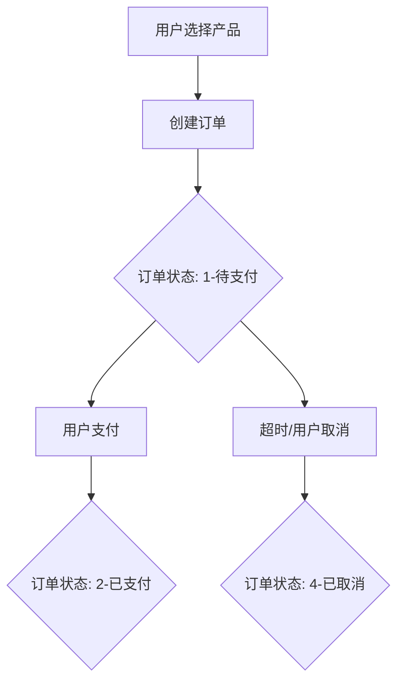
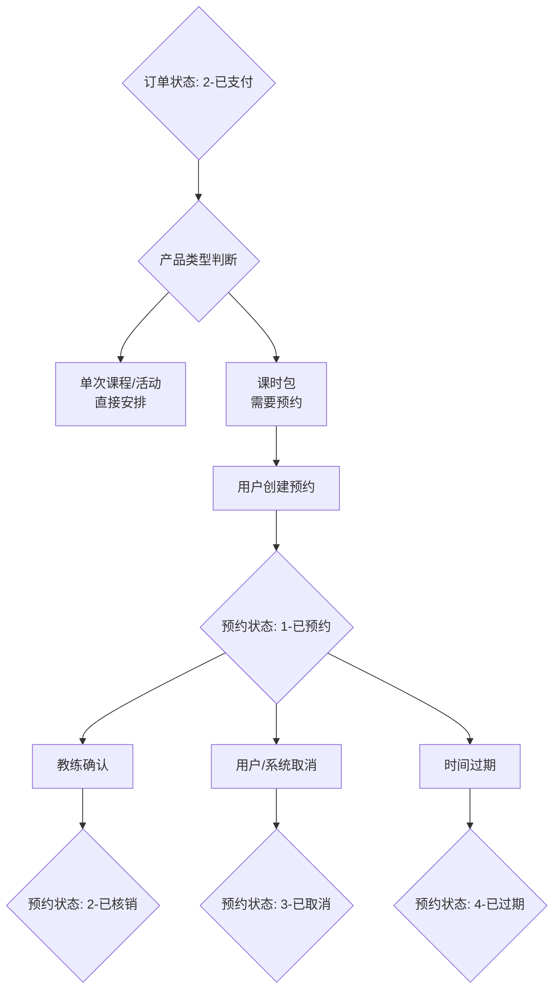
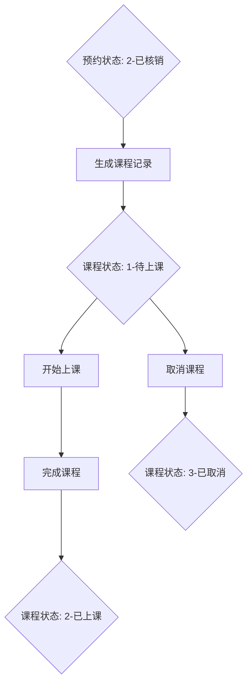

# 马术俱乐部管理系统 - 业务状态流转说明文档

## 📋 概述

本文档详细说明了马术俱乐部管理系统中从下单到最终核销的完整业务流程，包含订单、预约、课程三级状态管理体系以及不同产品类型的处理逻辑。

---

## 🏗️ 系统架构

### 三级状态管理体系
```
订单状态 (Order) → 预约状态 (Booking) → 课程状态 (Lesson)
     ↓                  ↓                   ↓
业务订购管理        时间安排管理         实际教学管理
```

---

## 📊 状态定义

### 1. 订单状态 (ORDER_STATUS_ENUM)

| 状态值 | 状态名称 | 颜色标识 | 说明 |
|-------|----------|----------|------|
| 1 | 待支付 | `orange` | 订单已创建，等待用户支付 |
| 2 | 已支付 | `green` | 用户已完成支付，可进行预约 |
| 3 | 已核销 | `blue` | 订单对应的服务已全部消费完成 |
| 4 | 已取消 | `red` | 订单被取消（支付前） |
| 5 | 已退款 | `purple` | 订单退款处理完成 |

### 2. 预约状态 (BOOKING_STATUS_ENUM)

| 状态值 | 状态名称 | 颜色标识 | 说明 |
|-------|----------|----------|------|
| 1 | 已预约 | `green` | 预约已创建，等待上课 |
| 2 | 已核销 | `blue` | 预约已确认完成（上课完成） |
| 3 | 已取消 | `red` | 预约被取消 |
| 4 | 已过期 | `gray` | 预约时间已过期，自动失效 |

### 3. 课程状态 (LESSON_STATUS_ENUM)

| 状态值 | 状态名称 | 颜色标识 | 说明 |
|-------|----------|----------|------|
| 1 | 待上课 | `orange` | 课程安排已确定，等待开始 |
| 2 | 已上课 | `green` | 课程已完成 |
| 3 | 已取消 | `red` | 课程被取消 |

---

## 🎯 产品类型

### 产品分类 (PRODUCT_TYPE)

| 类型值 | 产品类型 | 颜色标识 | 特点 |
|-------|----------|----------|------|
| 1 | 单次课程 | `blue` | 一次性消费，单节课程 |
| 2 | 课时包 | `green` | 多次消费，包含多个课时 |
| 3 | 活动 | `purple` | 特殊活动，如比赛、表演等 |

---

## 🔄 完整业务流程

### 阶段一：订单创建与支付



**关键规则：**
- 订单状态为 `1-待支付` 时：
  - ❌ **不生成预约记录**
  - ❌ **不生成课程记录**
  - ✅ **仅生成教练的不可用时间段记录**
  - 若订单取消，自动删除时间段记录

### 阶段二：预约管理（仅课时包）



**课时包特殊逻辑：**
- 支持**家庭成员代消费**（购买者 ≠ 消费者）
- 余额管理：`剩余课时 = 总课时 - 已用课时`
- 进度显示：`使用率 = 已用课时 / 总课时 * 100%`

### 阶段三：课程执行



---

## 📱 前端业务逻辑

### 综合视图 (`ScheduleManage.vue`)

#### 操作权限矩阵

| 操作 | 触发条件 | 业务逻辑 |
|-----|----------|----------|
| **添加预约** | `productType=2` && `remainingCount>0` | 仅课时包且有剩余课时 |
| **确认预约** | `bookingStatus=1` | 仅已预约状态可核销 |
| **改期** | `bookingStatus=1` | 仅已预约状态可改期 |
| **取消预约** | `bookingStatus∈[1,2]` | 已预约或已核销可取消 |

#### 订单卡片显示逻辑

```javascript
// 课时包余额进度条颜色
const getProgressColor = () => {
  const percent = (usedCount / totalCount) * 100;
  if (percent < 30) return '#52c41a';      // 绿色
  if (percent < 70) return '#faad14';      // 黄色  
  return '#f5222d';                        // 红色
};

// 代消费标识
const showDelegateTag = () => {
  return consumerMemberId !== buyerMemberId;
};
```

### 状态判断逻辑 (`BookingRecordList.vue`)

```javascript
// 基于新状态体系的业务规则
const canConfirm = (record) => {
  return record.bookingStatus === 1; // 已预约 → 可核销
};

const canReschedule = (record) => {
  return record.bookingStatus === 1; // 仅已预约可改期
};

const canCancel = (record) => {
  return [1, 2].includes(record.bookingStatus); // 已预约、已核销可取消
};
```

---

## 🔙 后端处理逻辑

### API 接口设计原则

1. **状态原子性**：每个状态变更都是原子操作
2. **数据一致性**：状态变更时同步更新相关联的记录
3. **业务验证**：严格验证状态变更的前置条件

### 关键业务规则

#### 订单状态流转
```
订单已支付 → 预约状态已预约 → 课程待上课
订单已核销 → 预约状态已核销 → 课程已上课  
订单已取消/已退款 → 预约状态已取消 → 课程状态已取消
```

#### 资源管理
- **教练时间管理**：防止时间冲突，支持请假、占用状态
- **马匹资源管理**：跟踪马匹可用性，支持休息、治疗状态
- **场地资源**：时间段分配和冲突检测

#### 费用计算
- **课时包**：按课时数消费，记录 `packageConsumeCount`
- **单次课程**：固定费用，记录 `actualCoachFee`, `actualHorseFee`
- **活动**：特殊定价逻辑

---

## 📋 数据字段说明

### 订单表关键字段
```sql
order_id            -- 订单ID
order_no            -- 订单编号
order_status        -- 订单状态 (1-5)
product_type        -- 产品类型 (1-3)
buyer_member_id     -- 购买会员ID
total_count         -- 总课时数（课时包）
used_count          -- 已用课时数
remaining_count     -- 剩余课时数
expire_date         -- 过期时间
```

### 预约表关键字段
```sql
booking_id          -- 预约ID
order_id            -- 关联订单ID
booking_status      -- 预约状态 (1-4)
consumer_member_id  -- 消费会员ID（支持代消费）
coach_id            -- 教练ID
horse_id            -- 马匹ID
start_time          -- 开始时间
end_time            -- 结束时间
actual_coach_fee    -- 实际教练费用
actual_horse_fee    -- 实际马匹费用
package_consume_count -- 课时包消耗数量
```

### 课程表关键字段
```sql
lesson_id           -- 课程ID
booking_id          -- 关联预约ID
lesson_status       -- 课程状态 (1-3)
schedule_id         -- 课表ID
actual_start_time   -- 实际开始时间
actual_end_time     -- 实际结束时间
```

---

## ⚠️ 异常处理

### 常见异常情况

1. **订单支付超时**
   - 自动取消订单
   - 释放预占的教练时间段

2. **预约过期处理**
   - 系统定时任务扫描过期预约
   - 状态更新为 `4-已过期`
   - 支持自动退款

3. **资源冲突**
   - 教练时间冲突检测
   - 马匹分配冲突处理
   - 提供冲突解决建议

4. **课时包余额不足**
   - 前端实时校验
   - 后端二次验证
   - 提示用户续购

---

## 📈 统计与报表

### 业务指标

- **订单转化率**：`已支付订单数 / 总订单数`
- **课时包利用率**：`已用课时 / 总课时`
- **预约完成率**：`已核销预约 / 总预约数`
- **教练工作量**：各教练的课程数量统计
- **会员活跃度**：会员消费频次分析

### 数据报表

- 日/周/月营收统计
- 课程类型销售分析
- 会员消费行为分析
- 教练绩效统计
- 马匹使用率统计

---

## 🔧 系统配置

### 时间配置
```javascript
BUSINESS_HOURS: {
  START: '09:00',      // 营业开始时间
  END: '21:00'         // 营业结束时间
},
INTERVAL: 30,          // 时间段间隔（分钟）
CACHE_DURATION: 300000 // 缓存时长（5分钟）
```

### 通知配置
```javascript
NOTIFICATION: {
  ADVANCE_HOURS: 2,    // 提前通知时间（小时）
  REMINDER_HOURS: 0.5  // 提醒时间（小时）
}
```

---

## 📝 更新日志

### v2.0.0 (2024-08-24)
- ✅ 统一状态管理体系，移除旧状态映射
- ✅ 优化综合视图显示逻辑
- ✅ 完善课时包余额管理
- ✅ 增强资源冲突检测

### v1.0.0 (2024-08-16)
- 🎉 初始版本发布
- 基础订单、预约、课程管理功能

---

## 📞 技术支持

如有疑问，请联系开发团队：
- 项目负责人：1024创新实验室
- 技术文档：本README文档
- 问题反馈：通过系统内置反馈功能

---

*本文档最后更新时间：2024年8月24日*