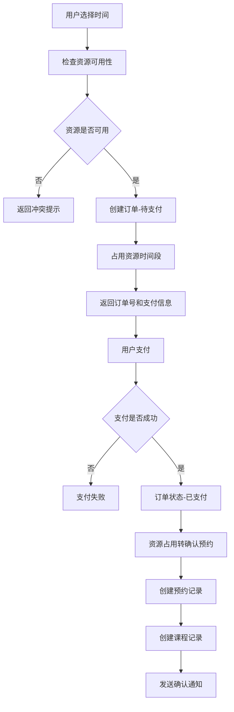
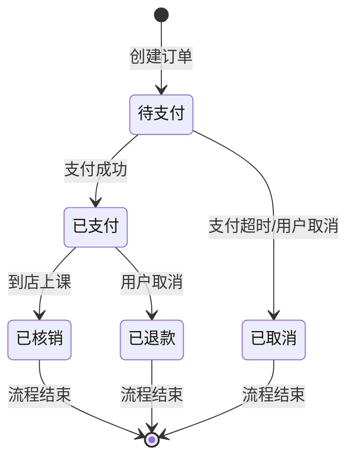

# 马术俱乐部订单系统全链路改造方案

## 📋 项目概述

基于新的业务状态设计（待支付不生成预约记录，只占用资源时间段），对现有订单创建流程进行全面改造，实现更符合实际业务场景的订单管理系统。

## 🎯 改造目标

### 新状态设计
- **订单状态**：1-待支付、2-已支付、3-已核销、4-已取消、5-已退款
- **预约状态**：1-已预约、2-已核销、3-已取消、4-已过期
- **课程状态**：1-待上课、2-已上课、3-已取消
- **资源占用状态**：5-待支付占用、6-已确认预约

### 核心业务逻辑
1. **待支付阶段**：只在资源时间表中创建占用记录，不生成预约和课程记录
2. **已支付阶段**：创建预约记录和课程记录，资源占用转为已确认状态
3. **过期处理**：支付超时自动释放资源，预约过期自动退款

## 🔄 全链路业务流程

### 1. 订单创建流程



### 2. 状态流转关系



## 📊 数据库改造方案

### 1. 资源时间表状态扩展

```sql
-- 扩展资源时间表状态
ALTER TABLE m_resource_schedule 
MODIFY COLUMN status tinyint DEFAULT 1 NOT NULL 
COMMENT '状态: 1-请假 2-占用 3-维护 4-其他 5-待支付占用 6-已确认预约';

-- 添加订单关联字段
ALTER TABLE m_resource_schedule 
ADD COLUMN order_no varchar(50) DEFAULT NULL COMMENT '关联订单号',
ADD COLUMN expire_time datetime DEFAULT NULL COMMENT '过期时间（待支付占用）';

-- 添加索引
CREATE INDEX idx_order_no ON m_resource_schedule(order_no);
CREATE INDEX idx_expire_time ON m_resource_schedule(expire_time);
```

### 2. 订单表字段完善

```sql
-- 添加支付相关字段
ALTER TABLE m_order 
ADD COLUMN payment_expire_time datetime DEFAULT NULL COMMENT '支付过期时间',
ADD COLUMN auto_cancel_flag tinyint DEFAULT 0 COMMENT '是否自动取消: 0-否 1-是';
```

### 3. 预约表调整

```sql
-- 预约表状态注释更新
ALTER TABLE m_booking 
MODIFY COLUMN booking_status tinyint NOT NULL DEFAULT '1' 
COMMENT '预约状态: 1-已预约 2-已核销 3-已取消 4-已过期';

-- 添加过期处理字段
ALTER TABLE m_booking
ADD COLUMN expire_date date DEFAULT NULL COMMENT '预约过期日期';
```

## 💻 后端代码改造

### 1. 新增资源时间管理服务

**ResourceScheduleService.java**

```java
@Service
@Slf4j
public class ResourceScheduleService {
    
    @Resource
    private ResourceScheduleDao resourceScheduleDao;
    
    /**
     * 检查资源可用性
     */
    public ResponseDTO<Boolean> checkResourceAvailability(
            Long clubId, Integer resourceType, Long resourceId, 
            LocalDate date, LocalTime startTime, LocalTime endTime) {
        
        LambdaQueryWrapper<ResourceScheduleEntity> wrapper = new LambdaQueryWrapper<>();
        wrapper.eq(ResourceScheduleEntity::getClubId, clubId)
               .eq(ResourceScheduleEntity::getResourceType, resourceType)
               .eq(ResourceScheduleEntity::getResourceId, resourceId)
               .eq(ResourceScheduleEntity::getScheduleDate, date)
               .and(w -> w.le(ResourceScheduleEntity::getStartTime, startTime)
                          .ge(ResourceScheduleEntity::getEndTime, endTime)
                        .or()
                        .between(ResourceScheduleEntity::getStartTime, startTime, endTime)
                        .or()  
                        .between(ResourceScheduleEntity::getEndTime, startTime, endTime));
        
        Long count = resourceScheduleDao.selectCount(wrapper);
        return ResponseDTO.ok(count == 0);
    }
    
    /**
     * 占用资源时间段（待支付）
     */
    @Transactional(rollbackFor = Exception.class)
    public ResponseDTO<Void> occupyResourceTimeSlot(
            String orderNo, Long clubId, Integer resourceType, Long resourceId,
            LocalDate date, LocalTime startTime, LocalTime endTime, 
            LocalDateTime expireTime) {
        
        ResourceScheduleEntity entity = new ResourceScheduleEntity();
        entity.setClubId(clubId);
        entity.setResourceType(resourceType);
        entity.setResourceId(resourceId);
        entity.setScheduleDate(date);
        entity.setStartTime(startTime);
        entity.setEndTime(endTime);
        entity.setStatus(5); // 待支付占用
        entity.setTitle("待支付占用");
        entity.setDescription("订单号:" + orderNo);
        entity.setOrderNo(orderNo);
        entity.setExpireTime(expireTime);
        entity.setCreatedBy("system");
        
        resourceScheduleDao.insert(entity);
        return ResponseDTO.ok();
    }
    
    /**
     * 确认资源预约（已支付）
     */
    @Transactional(rollbackFor = Exception.class) 
    public ResponseDTO<Void> confirmResourceBooking(String orderNo) {
        LambdaUpdateWrapper<ResourceScheduleEntity> wrapper = new LambdaUpdateWrapper<>();
        wrapper.set(ResourceScheduleEntity::getStatus, 6) // 已确认预约
               .set(ResourceScheduleEntity::getTitle, "已确认预约") 
               .set(ResourceScheduleEntity::getExpireTime, null)
               .set(ResourceScheduleEntity::getUpdatedBy, "system")
               .set(ResourceScheduleEntity::getUpdateTime, LocalDateTime.now())
               .eq(ResourceScheduleEntity::getOrderNo, orderNo)
               .eq(ResourceScheduleEntity::getStatus, 5);
        
        resourceScheduleDao.update(null, wrapper);
        return ResponseDTO.ok();
    }
    
    /**
     * 释放资源时间段
     */
    @Transactional(rollbackFor = Exception.class)
    public ResponseDTO<Void> releaseResourceTimeSlot(String orderNo) {
        LambdaQueryWrapper<ResourceScheduleEntity> wrapper = new LambdaQueryWrapper<>();
        wrapper.eq(ResourceScheduleEntity::getOrderNo, orderNo);
        
        resourceScheduleDao.delete(wrapper);
        return ResponseDTO.ok();
    }
    
    /**
     * 获取资源可用时间段
     */
    public ResponseDTO<List<TimeSlotVO>> getAvailableTimeSlots(
            Long clubId, Integer resourceType, Long resourceId, LocalDate date) {
        
        // 1. 获取俱乐部营业时间
        ClubEntity club = clubDao.selectById(clubId);
        if (club == null) {
            return ResponseDTO.userErrorParam("俱乐部不存在");
        }
        
        // 2. 获取已占用时间段
        LambdaQueryWrapper<ResourceScheduleEntity> wrapper = new LambdaQueryWrapper<>();
        wrapper.eq(ResourceScheduleEntity::getClubId, clubId)
               .eq(ResourceScheduleEntity::getResourceType, resourceType)
               .eq(ResourceScheduleEntity::getResourceId, resourceId)
               .eq(ResourceScheduleEntity::getScheduleDate, date)
               .in(ResourceScheduleEntity::getStatus, Arrays.asList(1,2,3,4,5,6));
        
        List<ResourceScheduleEntity> occupiedSlots = resourceScheduleDao.selectList(wrapper);
        
        // 3. 计算可用时间段
        List<TimeSlotVO> availableSlots = calculateAvailableSlots(
                club.getBusinessStartTime(), club.getBusinessEndTime(), occupiedSlots);
        
        return ResponseDTO.ok(availableSlots);
    }
    
    /**
     * 计算可用时间段
     */
    private List<TimeSlotVO> calculateAvailableSlots(
            LocalTime businessStart, LocalTime businessEnd,
            List<ResourceScheduleEntity> occupiedSlots) {
        
        List<TimeSlotVO> availableSlots = new ArrayList<>();
        
        // 按开始时间排序占用时间段
        occupiedSlots.sort(Comparator.comparing(ResourceScheduleEntity::getStartTime));
        
        LocalTime currentTime = businessStart;
        
        for (ResourceScheduleEntity occupied : occupiedSlots) {
            // 如果当前时间早于占用开始时间，说明有可用时间段
            if (currentTime.isBefore(occupied.getStartTime())) {
                TimeSlotVO slot = new TimeSlotVO();
                slot.setStartTime(currentTime);
                slot.setEndTime(occupied.getStartTime());
                availableSlots.add(slot);
            }
            
            // 更新当前时间为占用结束时间
            if (occupied.getEndTime().isAfter(currentTime)) {
                currentTime = occupied.getEndTime();
            }
        }
        
        // 检查最后一个时间段到营业结束时间
        if (currentTime.isBefore(businessEnd)) {
            TimeSlotVO slot = new TimeSlotVO();
            slot.setStartTime(currentTime);
            slot.setEndTime(businessEnd);
            availableSlots.add(slot);
        }
        
        return availableSlots;
    }
}
```

### 2. 改造HomeService.createOrder()

**HomeService.java**

```java
@Service
@Slf4j
public class HomeService {
    
    @Resource
    private ResourceScheduleService resourceScheduleService;
    @Resource
    private OrderDao orderDao;
    @Resource
    private ClubDao clubDao;
    @Resource
    private CoachDao coachDao;
    @Resource
    private ProductDao productDao;
    
    /**
     * 创建订单 - 完整实现
     */
    @Transactional(rollbackFor = Exception.class)
    public ResponseDTO<OrderCreateVO> createOrder(OrderCreateForm form) {
        try {
            // 1. 数据校验
            ResponseDTO<ValidationResult> validationResult = validateOrderCreateForm(form);
            if (!validationResult.ok()) {
                return ResponseDTO.error(validationResult.getCode(), validationResult.getMsg());
            }
            
            ValidationResult validation = validationResult.getData();
            ClubEntity club = validation.getClub();
            CoachEntity coach = validation.getCoach();
            ProductEntity product = validation.getProduct();
            
            // 2. 检查时间段可用性
            for (BookingTimeVO timeInfo : form.getTimes()) {
                LocalDate date = LocalDate.parse(timeInfo.getDate());
                
                for (String timeSlot : timeInfo.getTimeSlots()) {
                    String[] times = timeSlot.split("-");
                    LocalTime startTime = LocalTime.parse(times[0]);
                    LocalTime endTime = LocalTime.parse(times[1]);
                    
                    // 检查教练可用性
                    ResponseDTO<Boolean> coachAvailable = resourceScheduleService
                            .checkResourceAvailability(club.getClubId(), 2, coach.getCoachId(), 
                                                     date, startTime, endTime);
                    
                    if (!coachAvailable.getData()) {
                        return ResponseDTO.userErrorParam(
                                String.format("教练%s在%s %s时间段不可用", 
                                            coach.getActualName(), date, timeSlot));
                    }
                }
            }
            
            // 3. 生成订单号
            String orderNo = generateOrderNo();
            
            // 4. 创建订单记录
            OrderEntity order = buildOrderEntity(form, validation, orderNo);
            order.setOrderStatus(1); // 待支付
            order.setPaymentExpireTime(LocalDateTime.now().plusMinutes(30)); // 30分钟支付期限
            orderDao.insert(order);
            
            // 5. 占用教练时间段
            LocalDateTime expireTime = LocalDateTime.now().plusMinutes(30);
            for (BookingTimeVO timeInfo : form.getTimes()) {
                LocalDate date = LocalDate.parse(timeInfo.getDate());
                
                for (String timeSlot : timeInfo.getTimeSlots()) {
                    String[] times = timeSlot.split("-");
                    LocalTime startTime = LocalTime.parse(times[0]);
                    LocalTime endTime = LocalTime.parse(times[1]);
                    
                    resourceScheduleService.occupyResourceTimeSlot(
                            orderNo, club.getClubId(), 2, coach.getCoachId(),
                            date, startTime, endTime, expireTime);
                }
            }
            
            // 6. 构建响应
            OrderCreateVO vo = buildOrderCreateVO(order);
            
            log.info("订单创建成功，订单号：{}", orderNo);
            return ResponseDTO.ok(vo);
            
        } catch (Exception e) {
            log.error("创建订单失败", e);
            return ResponseDTO.error(SystemErrorCode.SYSTEM_ERROR, "创建订单失败");
        }
    }
    
    /**
     * 订单数据校验
     */
    private ResponseDTO<ValidationResult> validateOrderCreateForm(OrderCreateForm form) {
        ValidationResult result = new ValidationResult();
        
        // 1. 校验俱乐部
        ClubEntity club = clubDao.getByClubCode(form.getClubCode());
        if (club == null) {
            return ResponseDTO.userErrorParam("俱乐部不存在");
        }
        result.setClub(club);
        
        // 2. 校验教练
        CoachEntity coach = coachDao.getByCoachNo(form.getCoachNo());
        if (coach == null) {
            return ResponseDTO.userErrorParam("教练不存在");
        }
        if (!coach.getClubId().equals(club.getClubId())) {
            return ResponseDTO.userErrorParam("教练不属于该俱乐部");
        }
        result.setCoach(coach);
        
        // 3. 校验课程
        ProductEntity product = productDao.getByCourseCode(form.getCourseCode());
        if (product == null) {
            return ResponseDTO.userErrorParam("课程不存在");
        }
        if (!product.getClubId().equals(club.getClubId())) {
            return ResponseDTO.userErrorParam("课程不属于该俱乐部");
        }
        result.setProduct(product);
        
        // 4. 校验时间格式
        for (BookingTimeVO timeInfo : form.getTimes()) {
            try {
                LocalDate.parse(timeInfo.getDate());
                for (String timeSlot : timeInfo.getTimeSlots()) {
                    if (!timeSlot.matches("\\d{2}:\\d{2}-\\d{2}:\\d{2}")) {
                        return ResponseDTO.userErrorParam("时间格式错误：" + timeSlot);
                    }
                }
            } catch (Exception e) {
                return ResponseDTO.userErrorParam("日期格式错误：" + timeInfo.getDate());
            }
        }
        
        // 5. 校验金额
        BigDecimal expectedTotal = form.getCoachFee().add(form.getBaseFee());
        if (expectedTotal.compareTo(form.getTotalAmount()) != 0) {
            return ResponseDTO.userErrorParam("金额计算错误");
        }
        
        return ResponseDTO.ok(result);
    }
    
    /**
     * 构建订单实体
     */
    private OrderEntity buildOrderEntity(OrderCreateForm form, ValidationResult validation, String orderNo) {
        OrderEntity order = new OrderEntity();
        order.setOrderNo(orderNo);
        order.setClubId(validation.getClub().getClubId());
        order.setMemberId(getCurrentMemberId());
        order.setOrderType(1); // 课程订单
        order.setOrderStatus(1); // 待支付
        order.setTotalAmount(form.getTotalAmount());
        order.setPaidAmount(BigDecimal.ZERO);
        order.setPaymentMethod("");
        order.setRemark("");
        
        // 设置商品信息（合并后的字段）
        order.setProductId(validation.getProduct().getProductId());
        order.setProductName(validation.getProduct().getProductName());
        order.setProductType(validation.getProduct().getProductType());
        order.setQuantity(calculateTotalQuantity(form.getTimes()));
        order.setUnitPrice(calculateUnitPrice(form.getTotalAmount(), order.getQuantity()));
        order.setCoachId(validation.getCoach().getCoachId());
        order.setPreferredTimes(JSON.toJSONString(form.getTimes()));
        
        order.setCreateBy("member");
        return order;
    }
    
    /**
     * 计算总课时数
     */
    private Integer calculateTotalQuantity(List<BookingTimeVO> times) {
        return times.stream()
                   .mapToInt(timeInfo -> timeInfo.getTimeSlots().size())
                   .sum();
    }
    
    /**
     * 计算单价
     */
    private BigDecimal calculateUnitPrice(BigDecimal totalAmount, Integer quantity) {
        return totalAmount.divide(BigDecimal.valueOf(quantity), 2, RoundingMode.HALF_UP);
    }
    
    /**
     * 构建订单创建响应
     */
    private OrderCreateVO buildOrderCreateVO(OrderEntity order) {
        OrderCreateVO vo = new OrderCreateVO();
        vo.setOrderNo(order.getOrderNo());
        vo.setStatus(order.getOrderStatus());
        vo.setCreateTime(order.getCreateTime());
        vo.setExpireTime(order.getPaymentExpireTime());
        
        // 计算支付倒计时
        long countdown = Duration.between(LocalDateTime.now(), order.getPaymentExpireTime()).getSeconds();
        vo.setPaymentCountdown(Math.max(0, countdown));
        
        return vo;
    }
    
    /**
     * 生成订单号
     */
    private String generateOrderNo() {
        String timestamp = LocalDateTime.now().format(
                DateTimeFormatter.ofPattern("yyyyMMddHHmmss"));
        String randomNum = String.format("%06d", new Random().nextInt(1000000));
        return "ORD" + timestamp + randomNum;
    }
    
    /**
     * 获取当前会员ID（从登录信息中获取）
     */
    private Long getCurrentMemberId() {
        // TODO: 从当前登录信息中获取会员ID
        // 这里暂时返回固定值，实际应该从SecurityContext或Session中获取
        return 1L;
    }
    
    /**
     * 校验结果内部类
     */
    @Data
    private static class ValidationResult {
        private ClubEntity club;
        private CoachEntity coach;
        private ProductEntity product;
    }
}
```

### 3. 新增支付成功处理接口

**PaymentController.java**

```java
@RestController
@RequestMapping("/api/payment")
@Tag(name = "支付回调", description = "支付成功回调处理")
public class PaymentController {
    
    @Resource
    private PaymentService paymentService;
    
    /**
     * 支付成功回调
     */
    @PostMapping("/callback/success")
    @Operation(summary = "支付成功回调")
    public ResponseDTO<Void> paymentSuccess(@RequestBody PaymentCallbackForm form) {
        return paymentService.handlePaymentSuccess(form);
    }
}
```

**PaymentService.java**

```java
@Service
@Slf4j
public class PaymentService {
    
    @Resource
    private OrderDao orderDao;
    @Resource
    private BookingDao bookingDao;
    @Resource
    private LessonScheduleDao lessonScheduleDao;
    @Resource
    private ResourceScheduleService resourceScheduleService;
    
    /**
     * 处理支付成功
     */
    @Transactional(rollbackFor = Exception.class)
    public ResponseDTO<Void> handlePaymentSuccess(PaymentCallbackForm form) {
        try {
            // 1. 查询订单
            OrderEntity order = orderDao.getByOrderNo(form.getOrderNo());
            if (order == null) {
                return ResponseDTO.userErrorParam("订单不存在");
            }
            
            if (!order.getOrderStatus().equals(1)) {
                return ResponseDTO.userErrorParam("订单状态异常");
            }
            
            // 2. 更新订单状态
            order.setOrderStatus(2); // 已支付
            order.setPaidAmount(form.getPaymentAmount());
            order.setPaymentMethod(form.getPaymentMethod());
            order.setPaymentTime(LocalDateTime.now());
            orderDao.updateById(order);
            
            // 3. 确认资源预约
            resourceScheduleService.confirmResourceBooking(order.getOrderNo());
            
            // 4. 创建预约记录
            List<BookingEntity> bookings = createBookingsFromOrder(order);
            for (BookingEntity booking : bookings) {
                bookingDao.insert(booking);
                
                // 5. 创建课程记录
                LessonScheduleEntity lesson = createLessonFromBooking(booking);
                lessonScheduleDao.insert(lesson);
            }
            
            log.info("支付成功处理完成，订单号：{}", order.getOrderNo());
            return ResponseDTO.ok();
            
        } catch (Exception e) {
            log.error("处理支付成功失败", e);
            return ResponseDTO.error(SystemErrorCode.SYSTEM_ERROR, "处理支付失败");
        }
    }
    
    /**
     * 从订单创建预约记录
     */
    private List<BookingEntity> createBookingsFromOrder(OrderEntity order) {
        List<BookingEntity> bookings = new ArrayList<>();
        
        // 解析预约时间信息
        String preferredTimesJson = order.getPreferredTimes();
        List<BookingTimeVO> times = JSON.parseArray(preferredTimesJson, BookingTimeVO.class);
        
        for (BookingTimeVO timeInfo : times) {
            LocalDate date = LocalDate.parse(timeInfo.getDate());
            
            for (String timeSlot : timeInfo.getTimeSlots()) {
                String[] timeParts = timeSlot.split("-");
                LocalTime startTime = LocalTime.parse(timeParts[0]);
                LocalTime endTime = LocalTime.parse(timeParts[1]);
                
                BookingEntity booking = new BookingEntity();
                booking.setOrderId(order.getOrderId());
                booking.setOrderItemId(0L); // 合并后无订单明细
                booking.setClubId(order.getClubId());
                booking.setMemberId(order.getMemberId());
                booking.setConsumerMemberId(null); // 默认自己消费
                booking.setProductId(order.getProductId());
                booking.setCoachId(order.getCoachId());
                booking.setHorseId(0L); // TODO: 从订单中获取马匹信息
                booking.setStartTime(LocalDateTime.of(date, startTime));
                booking.setEndTime(LocalDateTime.of(date, endTime));
                booking.setBookingStatus(1); // 已预约
                booking.setPackageConsumeCount(1);
                booking.setActualCoachFee(BigDecimal.ZERO);
                booking.setActualHorseFee(BigDecimal.ZERO);
                booking.setCreateBy("system");
                
                bookings.add(booking);
            }
        }
        
        return bookings;
    }
    
    /**
     * 从预约创建课程记录
     */
    private LessonScheduleEntity createLessonFromBooking(BookingEntity booking) {
        LessonScheduleEntity lesson = new LessonScheduleEntity();
        lesson.setBookingId(booking.getBookingId());
        lesson.setScheduleNo(generateScheduleNo());
        lesson.setClubId(booking.getClubId());
        lesson.setMemberId(booking.getMemberId());
        lesson.setCoachId(booking.getCoachId());
        lesson.setHorseId(booking.getHorseId());
        lesson.setStartTime(booking.getStartTime());
        lesson.setEndTime(booking.getEndTime());
        lesson.setLessonStatus(1); // 待上课
        lesson.setDuration(calculateDuration(booking.getStartTime(), booking.getEndTime()));
        lesson.setCreateBy("system");
        
        return lesson;
    }
    
    /**
     * 生成课单号
     */
    private String generateScheduleNo() {
        String timestamp = LocalDateTime.now().format(
                DateTimeFormatter.ofPattern("yyyyMMddHHmmss"));
        String randomNum = String.format("%04d", new Random().nextInt(10000));
        return "SCH" + timestamp + randomNum;
    }
    
    /**
     * 计算课程时长（分钟）
     */
    private Integer calculateDuration(LocalDateTime startTime, LocalDateTime endTime) {
        return (int) Duration.between(startTime, endTime).toMinutes();
    }
}
```

### 4. 新增定时任务处理

**ScheduledTasks.java**

```java
@Component
@Slf4j
public class ScheduledTasks {
    
    @Resource
    private ResourceScheduleService resourceScheduleService;
    @Resource
    private OrderDao orderDao;
    @Resource
    private BookingDao bookingDao;
    
    /**
     * 清理过期的待支付订单占用
     * 每5分钟执行一次
     */
    @Scheduled(fixedRate = 300000)
    public void cleanExpiredPaymentOccupancy() {
        try {
            // 1. 查询过期的待支付订单
            LambdaQueryWrapper<OrderEntity> wrapper = new LambdaQueryWrapper<>();
            wrapper.eq(OrderEntity::getOrderStatus, 1) // 待支付
                   .lt(OrderEntity::getPaymentExpireTime, LocalDateTime.now());
            
            List<OrderEntity> expiredOrders = orderDao.selectList(wrapper);
            
            for (OrderEntity order : expiredOrders) {
                // 2. 更新订单状态为已取消
                order.setOrderStatus(4);
                order.setAutoCancelFlag(1);
                orderDao.updateById(order);
                
                // 3. 释放资源占用
                resourceScheduleService.releaseResourceTimeSlot(order.getOrderNo());
                
                log.info("自动取消过期订单：{}", order.getOrderNo());
            }
            
            if (!expiredOrders.isEmpty()) {
                log.info("批量处理过期订单完成，共处理{}个订单", expiredOrders.size());
            }
            
        } catch (Exception e) {
            log.error("清理过期订单失败", e);
        }
    }
    
    /**
     * 处理过期预约
     * 每天凌晨1点执行
     */
    @Scheduled(cron = "0 0 1 * * ?")
    public void handleExpiredBookings() {
        try {
            LocalDate yesterday = LocalDate.now().minusDays(1);
            
            // 1. 查询昨天的未上课预约
            LambdaQueryWrapper<BookingEntity> wrapper = new LambdaQueryWrapper<>();
            wrapper.eq(BookingEntity::getBookingStatus, 1) // 已预约
                   .lt(BookingEntity::getStartTime, yesterday.plusDays(1).atStartOfDay());
            
            List<BookingEntity> expiredBookings = bookingDao.selectList(wrapper);
            
            for (BookingEntity booking : expiredBookings) {
                // 2. 更新预约状态为已过期
                booking.setBookingStatus(4);
                bookingDao.updateById(booking);
                
                // 3. TODO: 触发自动退款流程
                processAutoRefund(booking);
                
                log.info("处理过期预约：预约ID={}", booking.getBookingId());
            }
            
            if (!expiredBookings.isEmpty()) {
                log.info("批量处理过期预约完成，共处理{}个预约", expiredBookings.size());
            }
            
        } catch (Exception e) {
            log.error("处理过期预约失败", e);
        }
    }
    
    /**
     * 处理自动退款
     */
    private void processAutoRefund(BookingEntity booking) {
        // TODO: 实现自动退款逻辑
        log.info("触发自动退款：预约ID={}", booking.getBookingId());
    }
}
```

## 🎨 前端代码调整

### 1. API接口路径统一

**order-api.js**

```javascript
export const orderApi = {
  /**
   * 创建订单
   */
  createOrder: (data) => {
    return postRequest('/app/home/order/create', data); // 修正路径
  },
  
  /**
   * 查询订单详情
   */
  getOrderDetail: (orderNo) => {
    return getRequest(`/app/home/order/detail/${orderNo}`);
  },
  
  /**
   * 取消订单
   */
  cancelOrder: (orderNo, reason) => {
    return postRequest('/app/home/order/cancel', { orderNo, reason });
  }
};
```

### 2. 订单创建表单验证

**OrderCreate.vue**

```javascript
// 表单验证规则
const rules = {
  clubCode: [
    { required: true, message: '请选择俱乐部', trigger: 'change' }
  ],
  coachNo: [
    { required: true, message: '请选择教练', trigger: 'change' }
  ],
  courseCode: [
    { required: true, message: '请选择课程', trigger: 'change' }
  ],
  times: [
    { required: true, type: 'array', min: 1, message: '请选择预约时间', trigger: 'change' }
  ],
  totalAmount: [
    { required: true, message: '金额不能为空', trigger: 'change' },
    { type: 'number', min: 0.01, message: '金额必须大于0', trigger: 'change' }
  ]
};

// 实时检查教练可用性
const checkCoachAvailability = async (coachId, date, timeSlots) => {
  try {
    const response = await scheduleApi.checkCoachAvailability({
      coachId,
      date,
      timeSlots
    });
    return response.data;
  } catch (error) {
    console.error('检查教练可用性失败:', error);
    return false;
  }
};

// 创建订单
const createOrder = async (formData) => {
  try {
    loading.value = true;
    
    // 1. 最后一次可用性检查
    for (const timeInfo of formData.times) {
      const available = await checkCoachAvailability(
        formData.coachNo, 
        timeInfo.date, 
        timeInfo.timeSlots
      );
      
      if (!available) {
        message.error(`${timeInfo.date} 的时间段已被预约，请重新选择`);
        return;
      }
    }
    
    // 2. 创建订单
    const response = await orderApi.createOrder(formData);
    
    if (response.code === 0) {
      message.success('订单创建成功');
      
      // 3. 跳转到支付页面
      router.push({
        path: '/payment',
        query: {
          orderNo: response.data.orderNo,
          amount: formData.totalAmount
        }
      });
    } else {
      message.error(response.msg || '创建订单失败');
    }
    
  } catch (error) {
    console.error('创建订单失败:', error);
    message.error('创建订单失败，请重试');
  } finally {
    loading.value = false;
  }
};
```

### 3. 支付倒计时组件

**PaymentCountdown.vue**

```javascript
<template>
  <div class="payment-countdown">
    <a-alert 
      :message="`请在 ${formatTime(countdown)} 内完成支付`"
      type="warning" 
      show-icon 
      :closable="false"
    />
  </div>
</template>

<script setup>
import { ref, onMounted, onUnmounted } from 'vue';

const props = defineProps({
  expireTime: {
    type: String,
    required: true
  }
});

const countdown = ref(0);
let timer = null;

const updateCountdown = () => {
  const now = new Date().getTime();
  const expire = new Date(props.expireTime).getTime();
  const diff = expire - now;
  
  if (diff <= 0) {
    countdown.value = 0;
    clearInterval(timer);
    // 触发订单过期事件
    emit('expired');
  } else {
    countdown.value = Math.floor(diff / 1000);
  }
};

const formatTime = (seconds) => {
  const minutes = Math.floor(seconds / 60);
  const secs = seconds % 60;
  return `${minutes}:${secs.toString().padStart(2, '0')}`;
};

onMounted(() => {
  updateCountdown();
  timer = setInterval(updateCountdown, 1000);
});

onUnmounted(() => {
  if (timer) {
    clearInterval(timer);
  }
});

const emit = defineEmits(['expired']);
</script>
```

## 🗑 需要移除的无用代码

### 1. 订单明细表相关代码

```java
// 删除以下文件和相关引用：
// - OrderItemEntity.java
// - OrderItemDao.java  
// - OrderItemService.java
// - OrderItemController.java
// - 所有与 m_order_item 表相关的 SQL 和 Mapper
```

### 2. 简化预约状态处理

```java
// BookingService.java 中删除复杂的状态转换逻辑
// 移除以下方法：
// - updateBookingToInProgress()
// - updateBookingToCompleted() 
// - 复杂的状态验证逻辑

// 保留核心方法：
// - createBooking()
// - cancelBooking() 
// - updateBookingStatus()
```

### 3. 移除冗余的课程状态管理

```java
// ScheduleService.java 中删除：
// - 复杂的课程状态自动流转逻辑
// - 预约状态到课程状态的复杂映射
// - 并行状态管理代码
```

## 📝 数据迁移脚本

### 1. 现有数据状态映射

```sql
-- 订单状态保持不变（已经符合新设计）
-- 订单状态：1-待支付、2-已支付、3-已核销、4-已取消、5-已退款

-- 预约状态映射
UPDATE m_booking SET booking_status = CASE booking_status
    WHEN 1 THEN 1  -- 待确认 -> 已预约
    WHEN 2 THEN 1  -- 已确认 -> 已预约  
    WHEN 3 THEN 1  -- 进行中 -> 已预约
    WHEN 4 THEN 2  -- 已完成 -> 已核销
    WHEN 5 THEN 3  -- 已取消 -> 已取消
    WHEN 6 THEN 3  -- 未到场 -> 已取消
    ELSE booking_status
END;

-- 课程状态映射
UPDATE m_lesson_schedule SET lesson_status = CASE lesson_status
    WHEN 1 THEN 1  -- 待上课 -> 待上课
    WHEN 2 THEN 1  -- 进行中 -> 待上课
    WHEN 3 THEN 2  -- 已完成 -> 已上课  
    WHEN 4 THEN 3  -- 已取消 -> 已取消
    ELSE lesson_status
END;
```

### 2. 为现有已支付订单创建资源占用记录

```sql
-- 为所有已支付的订单创建资源占用记录
INSERT INTO m_resource_schedule (
    club_id, resource_type, resource_id, schedule_date, 
    start_time, end_time, status, title, description,
    order_no, created_by, create_time
)
SELECT 
    b.club_id,
    2 as resource_type, -- 教练
    b.coach_id as resource_id,
    DATE(b.start_time) as schedule_date,
    TIME(b.start_time) as start_time,
    TIME(b.end_time) as end_time,
    6 as status, -- 已确认预约
    '已确认预约' as title,
    CONCAT('历史数据迁移-预约ID:', b.booking_id) as description,
    o.order_no,
    'migration' as created_by,
    NOW() as create_time
FROM m_booking b
JOIN m_order o ON b.order_id = o.order_id
WHERE o.order_status >= 2 -- 已支付及以上状态
  AND b.booking_status = 1; -- 已预约状态
```

## 🔍 测试验证方案

### 1. 单元测试

```java
@SpringBootTest
public class OrderCreateServiceTest {
    
    @Test
    public void testCreateOrder_Success() {
        // 测试正常订单创建流程
    }
    
    @Test
    public void testCreateOrder_CoachNotAvailable() {
        // 测试教练时间冲突场景
    }
    
    @Test
    public void testPaymentSuccess_UpdateStatus() {
        // 测试支付成功后状态更新
    }
    
    @Test
    public void testExpiredOrderCleanup() {
        // 测试过期订单清理
    }
}
```

### 2. 集成测试

```java
@SpringBootTest
@Transactional
public class OrderFlowIntegrationTest {
    
    @Test
    public void testCompleteOrderFlow() {
        // 1. 创建订单
        // 2. 检查资源占用
        // 3. 模拟支付成功
        // 4. 验证预约和课程记录创建
        // 5. 验证资源占用状态更新
    }
}
```

### 3. 压力测试

- **并发订单创建**：测试同一时间段多人预约的处理
- **支付回调并发**：测试支付成功回调的并发处理
- **定时任务性能**：测试大量过期订单的清理性能

## 📅 实施计划

### 第一阶段（1周）：基础架构
- [x] 数据库结构调整
- [ ] ResourceScheduleService 开发
- [ ] 核心业务逻辑重构

### 第二阶段（1周）：订单流程
- [ ] HomeService.createOrder() 完整实现  
- [ ] PaymentService 支付回调处理
- [ ] 定时任务开发

### 第三阶段（1周）：前端调整
- [ ] API接口路径统一
- [ ] 订单创建页面调整
- [ ] 支付倒计时功能

### 第四阶段（1周）：测试部署
- [ ] 单元测试编写
- [ ] 集成测试验证
- [ ] 数据迁移执行
- [ ] 生产环境部署

## ⚠ 风险控制

### 1. 数据一致性风险
- **应对**：使用数据库事务确保原子性
- **回滚**：保留原表结构，支持快速回滚

### 2. 并发冲突风险  
- **应对**：数据库唯一约束 + 乐观锁
- **监控**：添加并发冲突监控告警

### 3. 支付回调风险
- **应对**：幂等性处理 + 重试机制
- **兜底**：人工处理异常订单的工具

### 4. 定时任务风险
- **应对**：任务执行日志 + 异常通知
- **监控**：任务执行时间和成功率监控

## 📊 监控指标

### 1. 业务指标
- 订单创建成功率
- 支付成功率  
- 资源冲突率
- 订单过期率

### 2. 技术指标
- API响应时间
- 数据库查询性能
- 定时任务执行时间
- 系统异常率

## 📖 总结

本改造方案通过引入资源时间表管理，实现了更符合实际业务场景的订单流程：

1. **业务流程优化**：待支付不占用实际预约资源，避免资源浪费
2. **数据结构简化**：合并订单明细到订单主表，减少复杂关联
3. **状态管理清晰**：简化状态定义，明确状态流转关系  
4. **资源管理统一**：通过资源时间表统一管理教练、马匹等资源
5. **自动化处理**：支持过期订单和预约的自动处理

改造后的系统将更加稳定、高效，用户体验也会显著提升。